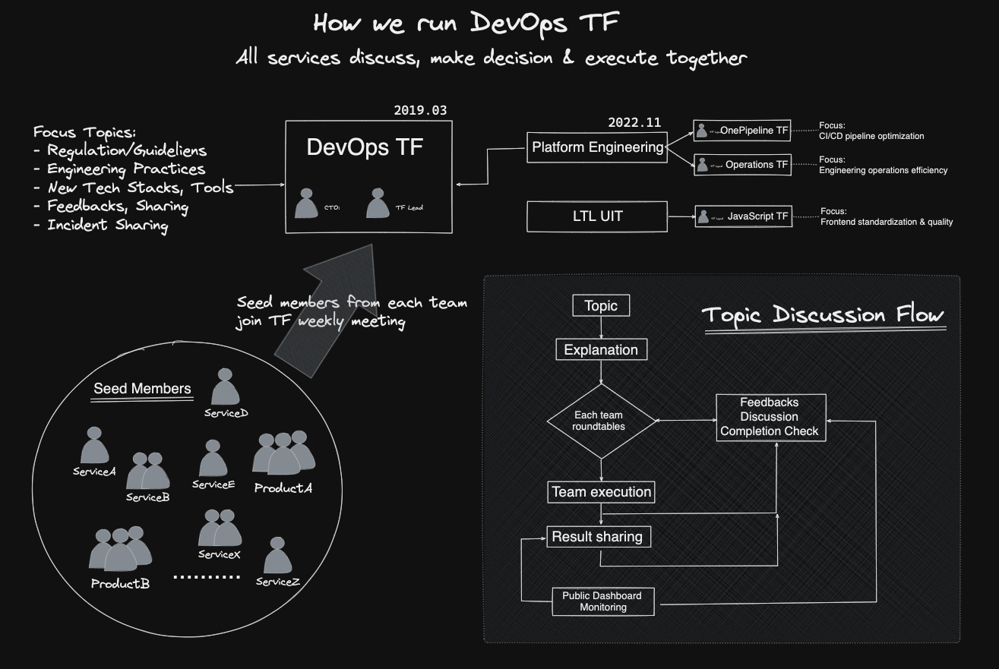

public:: true

- Name: **DevOps Task-Force**
	- History:
	  * 2019 - New tech & cloud native study group (自由參加)
	  * 2021 - 正式由每個服務指派專人參與，並授予 concurrent role & responsibilities
	- Process:
	  {:height 510, :width 750}
- Name: **Bryan Liu**
  LinkedIn: https://www.linkedin.com/in/bryan0817
	- **有感於 [PPT](https://mp.weixin.qq.com/s/8pgjVMWhlOh1Mey5udQOAQ) 對於觀念剖析、邏輯思維難有實質上的幫助，往往讓讀者淪為看圖說故事**，改以 (中文) 文字記錄方式希望能對知識及經驗上的傳遞做出些改善。歡迎使用文章內容或發 PR 讓內容更完整。
	- 演講經歷
	  * DevOpsDays Taipei 2024，[DevOps 困局與平台工程](https://pofengliu.github.io/devops-notes/#/page/devops%20%E8%AE%8A%E9%9D%A9%E5%9B%B0%E5%B1%80%E8%88%87%E5%B9%B3%E5%8F%B0%E5%B7%A5%E7%A8%8B)
	  * DevOpsDays Taipei 2023，[Community Driven DevOps](https://pofengliu.github.io/devops-notes/#/page/community driven devops)
	  * LINE TECHPULSE 2023，[以 DevOps 思維實施開發治理](https://speakerdeck.com/line_developers_tw/engineering-keynote-at-techpulse-2023?slide=13)
	  * LINE TECHPULSE 2020，[通過測試隔離改進自動化驗收測試](https://www.youtube.com/watch?v=CfPf9VtvkNk)
	  * DevOpsDays Taipei 2017，[百倍數交付談主幹開發](https://youtu.be/S4_PTkuavBI)
	  * DevOps Summit Taipei 2016，[Test Automation](https://www.slideshare.net/bryan0817/automated-acceptance-test-63726915)
- {{query (property type "blogpost") (sort-by updated-at desc))}}
  query-table:: false