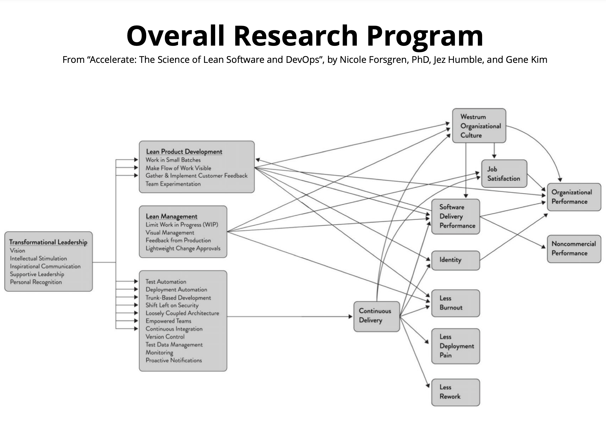

public:: true
tags:: #accelerate

- ## why
	- 相信才有辦法實踐
	- 腦袋看不見，眼睛也看不見。
- ## what
	- QUICK REFERENCE: CAPABILITIES TO DRIVE IMPROVEMENT
	  Our research has uncovered 24 key capabilities that drive improvements in software delivery performance. This reference will point you to them in the book. A detailed guide is found in Appendix A. They are presented in no particular order.
	- The capabilities are classified into five categories:
	  * Continuous delivery
	  * Architecture
	  * Product and process
	  * Lean management and monitoring
	  * Cultural
	- **CONTINUOUS DELIVERY CAPABILITIES**
		- 1. Version control: Chapter 4 
		  2. Deployment automation: Chapter 4
		  3. Continuous integration: Chapter 4
		  4. Trunk-based development: Chapter 4
		  5. Test automation: Chapter 4
		  6. Test data management: Chapter 4
		  7. Shift left on security: Chapter 6
		  8. Continuous delivery (CD): Chapter 4
	- **ARCHITECTURE CAPABILITIES**
		- 9. Loosely coupled architecture: Chapter 5
		  10. Empowered teams: Chapter 5
	- **PRODUCT AND PROCESS CAPABILITIES**
		- 11. Customer feedback: Chapter 8
		  12. Value stream: Chapter 8
		  13. Working in small batches: Chapter 8
		  14. Team experimentation: Chapter 8
	- **LEAN MANAGEMENT AND MONITORING CAPABILITIES**
		- 15. Change approval processes: Chapter 7
		  16. Monitoring: Chapter 7
		  17. Proactive notification: Chapter 13
		  18. WIP limits: Chapter 7
		  19. Visualizing work: Chapter 7
	- **CULTURAL CAPABILITIES**
		- 20. Westrum organizational culture: Chapter 3
		  21. Supporting learning: Chapter 10
		  22. Collaboration among teams: Chapters 3 and 5
		  23. Job satisfaction: Chapter 10
		  24. Transformational leadership: Chapter 11
- ## how
	- 
- ## how good
- ## inbox
- ## todo
- ## ref.
	- https://learning.oreilly.com/library/view/accelerate/9781457191435/09-quick.xhtml
	- https://learning.oreilly.com/library/view/accelerate/9781457191435/32-app_A.xhtml#FA.1
- ## related.
- ## archive.
-