- Now and then, code quality becomes an issue in a team and everyone starts to talk about how we can improve unit test and code coverage, but not for long. Eventually, it's not a hot topic anymore as people get busy. But then, you will experience déjà vu probably within a year, because the same idea comes back the next year.
- ## Unit test and code review
	- Peer code review is part of LINE's engineer culture, as our CTO explained to us during OJT. Facebook states the most three important things in development as code review, code review *and* code review. Yes, the only way to address unit test and improve code quality is to make unit test part of our engineer culture, and code review is here to help.
	- 
	  Boy scout rule for coding, from [{codemotion}](https://codemotionworld.com/)
	- Follow this boy scout rule which recommends reviewers to check if unit tests supplement new code and bug fixes during a review, and by continuously doing this, code coverage should expand or at least remain the same. For example, if code coverage drops, a reviewee should explain to the team the difficulties he/she is having and the reasons for not adding more tests. If all agree upon the explanation and has no issues, he/she can proceed. Otherwise, the reviewee shall fix it!
- ## Tips for effective code review
	- The most efficient way to do code review is through pair programming, but using PRs (Pull Request) on Github is okay, if this suits your team better. To get code review done, I mean *really* done, we should first try to increase the efficiency of code review processes; the idea is to treat reviewer as a rare resource, because none of our major responsibility is code reviewing, right?!
	  And here are some tips for effective and efficient code review:
	  * [Keep changes small](logseq://graph/DevOpsNotes?block-id=6585511f-2b98-4e9b-b27a-e3b7e4d40ad8)
	  * [Review often and shorten sessions](logseq://graph/DevOpsNotes?block-id=658551c8-5398-4be8-aef7-56641e557991)
	  * [Send pull request for review as early as possible](logseq://graph/DevOpsNotes?block-id=658551ed-d427-45d0-8ae2-e00a5240eddb)
	  * [Provide enough context for creating meaningful pull request](logseq://graph/DevOpsNotes?block-id=65855225-f50c-4783-82f8-c94cfbdce7e4)
	  * [Linting and code style check](logseq://graph/DevOpsNotes?block-id=6585529c-7af2-44a2-b5b5-ee3ad89e7e4f)
	- ### Keep changes small
	  id:: 6585511f-2b98-4e9b-b27a-e3b7e4d40ad8
		- A study by a Cisco System programming team has shown that 60 to 90 minute long review over 200 to 400 LoC (Line of Code) yields 70–90% defect discovery. Treat each PR as a releasable unit (feature, bug fix) or a cohesive idea which is meaningful to the PR. To learn why a large pull request hurts and what the optimal size for pull requests is, check [here](https://smallbusinessprogramming.com/optimal-pull-request-size/)([https://smallbusinessprogramming.com/optimal-pull-request-size/](https://smallbusinessprogramming.com/optimal-pull-request-size/)).
		- |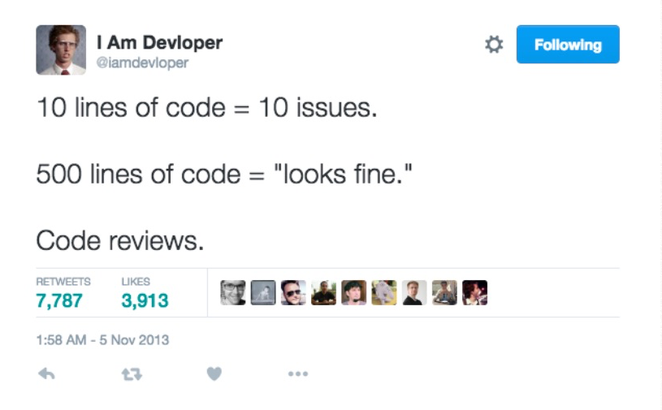{:height 259, :width 471}|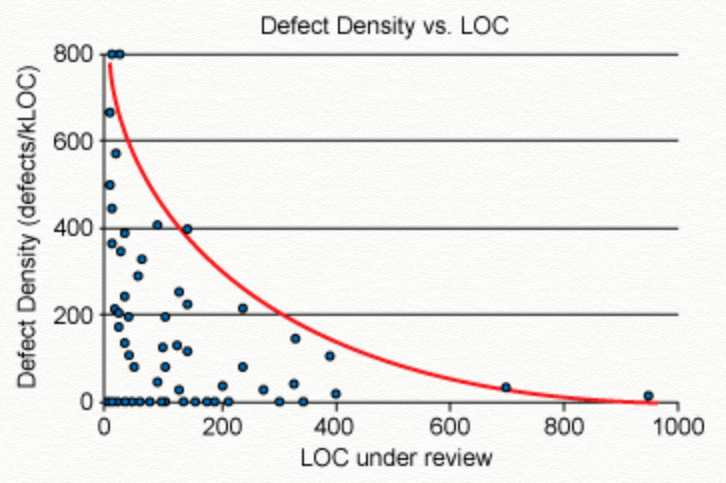{:height 303, :width 439}|
			- Code reviews, from [@iamdeveloper](https://twitter.com/iamdevloper) on Twitter & Defect density vs LoC, from [Cisco study case](https://smartbear.com/learn/code-review/best-practices-for-peer-code-review/)
	- ### Review often and shorten sessions
	  id:: 658551c8-5398-4be8-aef7-56641e557991
		- Code reviews in reasonable quantity, at a slower pace, for a limited amount of time result in the most effective code review. Beyond 400 LoC, the ability to find defects diminishes. Inspection rates under 300 LoC/hr is the best.
		- 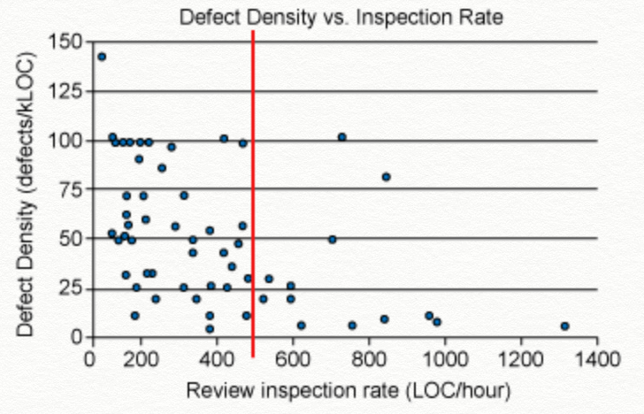{:height 315, :width 514}
			- Defect density vs inspection rate, from [Cisco study case](https://smartbear.com/learn/code-review/best-practices-for-peer-code-review/)
	- ### Send pull request to review as early as possible
	  id:: 658551ed-d427-45d0-8ae2-e00a5240eddb
		- To get a valuable code review, start a discussion before implementing details and try not to send big chunks of diffs. Separate different ideas into different PRs and assign different reviewers if needed, by dividing large problems into smaller problems and solving the small problems one at a time.
		- 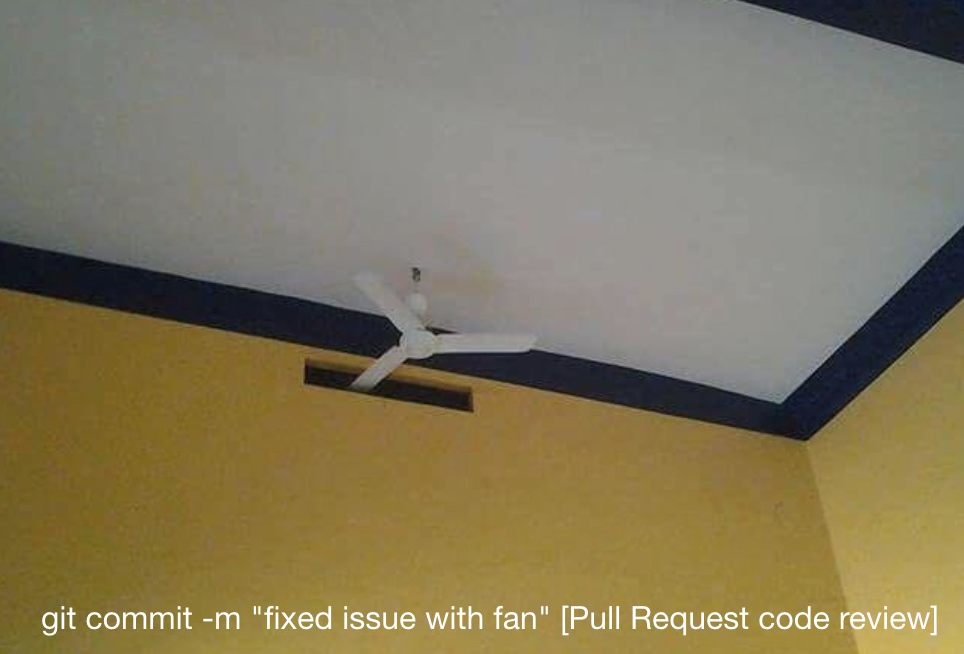{:height 335, :width 520}
			- How workaround gets applied, if architectural/design problems found in the last minute PR during code review, from [@isoiphone on Twitter](https://twitter.com/isoiphone/status/824771226585296896)
	- ### Provide enough context for creating meaningful pull request
	  id:: 65855225-f50c-4783-82f8-c94cfbdce7e4
		- >***Reviewer resource is very limited, treat it wisely!***
		- To help a reviewer get into the context quickly, providing sufficient information is important, such as why and how the change is being made, as well as any risks or concerns observed. Such information is a good catalyst for generating good discussions later. As an added benefit, the author will often find additional errors before the review even begins. Though not every PR is worthy writing such detail, but you can briefly annotate what's been done and tested or which part should a reviewer pay more attention to!
		- [Github issue and pull request templates](https://blog.github.com/2016-02-17-issue-and-pull-request-templates/) might do some help. Also, attaching a screenshot to describe what you are up to is a good idea! Here are a couple of examples on using PR templates to provide meaningful context for code review and further QA verification.
		- 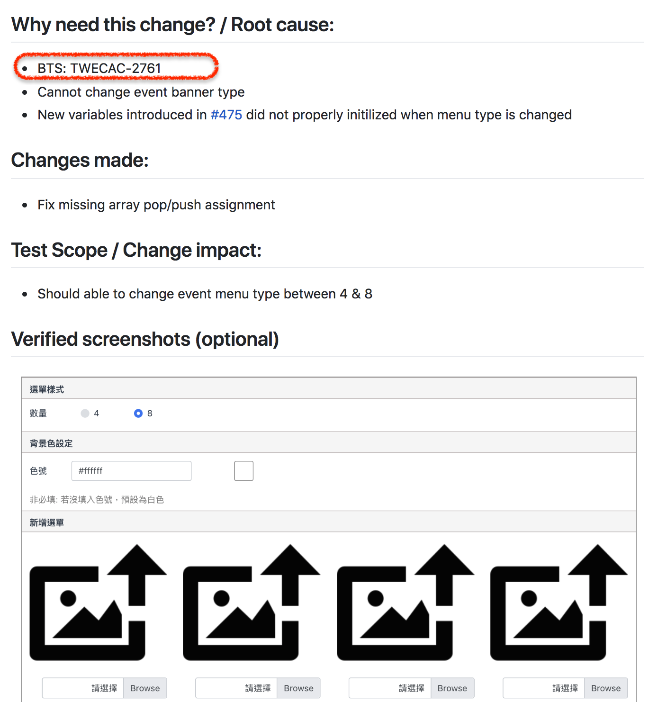{:height 602, :width 518} 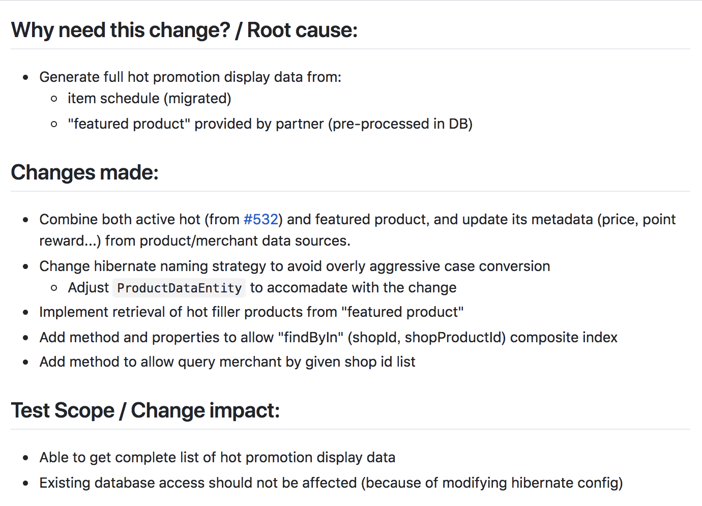{:height 508, :width 699}
			- Examples of using Github PR template
	- ### Linting and Code Style Check
	  id:: 6585529c-7af2-44a2-b5b5-ee3ad89e7e4f
		- Leave static code analysis and coding style check to machines with tools like [SonarQube](https://www.sonarqube.org/)([https://www.sonarqube.org/](https://www.sonarqube.org/)) and [ESLint](https://eslint.org/)([https://eslint.org/](https://eslint.org/)), and spare human eyes for important parts like business logics and algorithms. These code scanning tools, type checking tools and linting tools can report bugs, [code smells](https://en.wikipedia.org/wiki/Code_smell) and vulnerabilities, along with a good test suite can certainly increase the confidence level.
		- 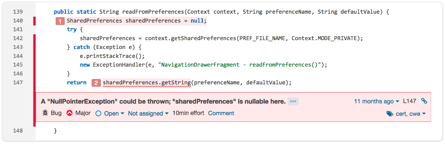
			- Detect issues in SonarQube from [SonarQube website](https://www.sonarqube.org/)
	- One of the most important part of code reviews is to reward developers for growth and effort, so try to offer *as many compliment** **as possible*.
	  Lastly, you can't give a proper review if you can't understand parts of the code. If your discussion seems to go back and forth, picking it up and finalizing the discussion in person would be more efficient.
- ## Make this part of our engineer culture
	- Someone said that "culture is what people do while no one is looking". Will you still write adequate tests for your code when code review process is skipped? Not easy right? But it's still worth trying! If your project has employed Agile, consider the following factors to make your team culture self-directed, continuously improving and learning:
	  * Autonomy: Team members take their responsibilities and work in the ways they prefer (Example: Scrum, pair programming)
	  * Mastery: Continuously performing good coding practices and learning from each other through code review can eventually enhance personal coding skills
	  * Purpose: Code quality is our ultimate goal, find bugs at an early stage instead of putting fire off in production
	- Thus to facilitate team culture building, I started my efforts with following two items:
	  * [Enhance Skill](logseq://graph/DevOpsNotes?block-id=6585538e-8b30-4661-b8c1-168c17872f6f)
	  * [Measure the progress](logseq://graph/DevOpsNotes?block-id=65855425-ae5e-4c02-be0b-5ca62310ff2a)
	- ### **Enhance Skill **
	  id:: 6585538e-8b30-4661-b8c1-168c17872f6f
		- Yes, to get to the bottom of making this work, developers still need to have a sound concept and complete knowledge to reach the growing consensus(practices) of their team in their daily work. To help developers, we leverage local consultancy to give workshops on unit test, refactoring and TDD (Test-Driven Development). 
		  We address the following topics in the workshop (listed but not limited):
		- 1. Unit test
		  * Design test cases to reveal intention rather than to test code implementation
		  * Identify and isolate dependency
		  * Introduce extract & overwrite and dependency injection methods
		  * Explain stub & mock framework and assertion libraries
		  * Practice refactoring skills like extract method, inline variables, and many others.
		- 2. [Kata](https://en.wikipedia.org/wiki/Kata_(programming)) hands on
		  * Requirement analysis, refine scenarios and find key examples
		  * Code design and implementation
		- 3. TDD and refactoring
		  * Demo refactoring, identifying code smells and associated methods to remove them
		  * Live coding with the TDD approach (Example: baby steps, red light green light)
		  * Hands on practice
	- ### **Measure the progress**
	  id:: 65855425-ae5e-4c02-be0b-5ca62310ff2a
		- >**If you can’t see it, you can’t measure it, you can’t improve it!**
		- By leveraging visual impact with public dashboards, message notification to continuously remind everyone in pursuit our goals, we have the following dashboards displayed in rotation on a big screen by the entrance gate.
		  * [SonarQube project dashboard](logseq://graph/DevOpsNotes?block-id=65855477-d320-4003-aaac-7829ff5fe177)
		  * [Team-based code coverage](logseq://graph/DevOpsNotes?block-id=658554a3-75c5-4a3c-91eb-600d1926805c)
		  * [PR size and resolution time](logseq://graph/DevOpsNotes?block-id=658554a3-06f6-43ec-be26-4adee24cdecb)
		  * [PR comment notification](logseq://graph/DevOpsNotes?block-id=6585555b-ed9b-4ed2-8665-1ccbf6f51eec)
		- #### SonarQube project dashboard
		  id:: 65855477-d320-4003-aaac-7829ff5fe177
			- All stats of static code analysis come from SonarQube, code repos directly link to production services should publish reports here.
			- 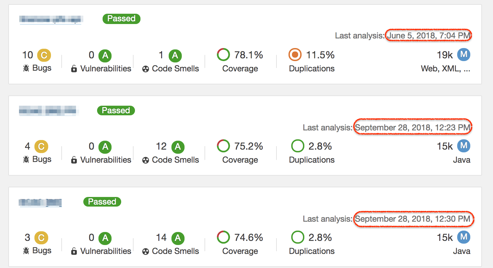
		- #### Team based code coverage
		  id:: 658554a3-75c5-4a3c-91eb-600d1926805c
			- Team based code coverage chart shows the coverage trend of each repository of a team, so you don't have to navigate into each SonarQube project page. By putting this type of charts side by side, it's easy to compare how different teams are doing.
			- 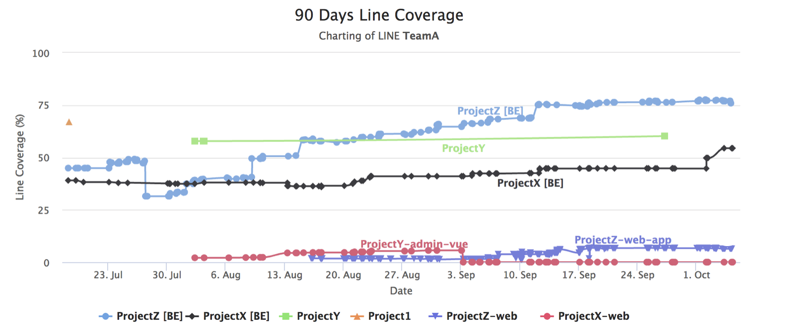
		- #### PR size and resolution time
		  id:: 658554a3-06f6-43ec-be26-4adee24cdecb
			- The core idea of DevOps is how to release software changes into production frequently but also with good quality. Making each deployment unit small is the trick here. Large PRs not only make good code review impossible but also costs in code quality and release cycle, so making a task/change small is a valid skill in DevOps. We try to promote this idea with the following "Resolution time vs. PR size" chart:
			- 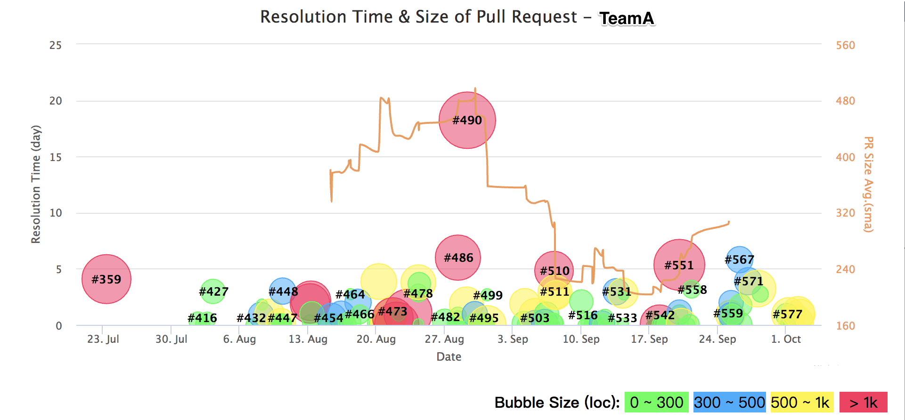
				- Bubble size: Change set size (line of code)
				- Resolution time: PR creation time to PR merge time
				- `#n`: PR number
		- These charts continuously create awareness to remind everyone the progresses of adopting good practices and goals we pursue. These are just some examples we made here. Think of your own which can visually show your intention to others. By the way, these are also useful to give a summary of progress during monthly meetings.
		- #### PR Comment Notification
		  id:: 6585555b-ed9b-4ed2-8665-1ccbf6f51eec
			- Each commit submitted to PR triggers a webhook to post a github comment as below. This is to remind the PR creator to add tests and fix new vulnerabilities found right inside this PR, because this is more efficient than making these up after two weeks later when changes are released to production. To make the quality index better, reviewers should also help to find out why the reviewee is having a problem.
			- 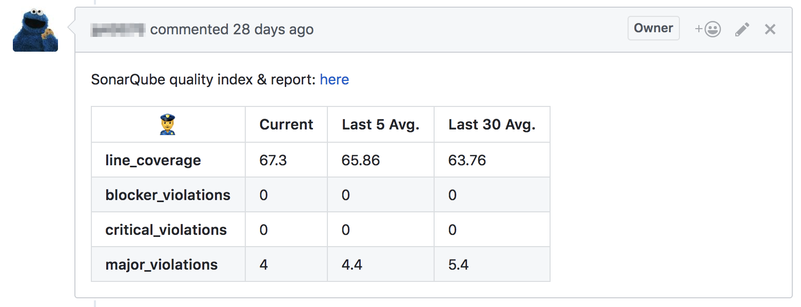
				- Last n Avg.: Shows the trend of each metric
				- xxx_violations: The number of bug, vulnerability and code smell found
				- line_coverage: The percentage of LoC which are executed by unit tests
- ## Summary & Future plans
	- How to write clean code and how to identify code smells and remove them provide a great context for code review discussion, and when team really spend time addressing these common issues, the culture is fostered along the way.
	- From the other side, metrics that do not get tracked are not useful; showing data trends over time is important, which gives context to allowing us to make corresponding actions. Looking at the trend lines shown in the charts above, things are moving with progress. Also we are going to consider adding more dashboards for the following:
	  * Quality: bug open / close count with severities, defect density
	  * Velocity: deployment frequency, lead time to production, change failure rate and MTTR
- ## Updates from the Year of 2022
	- It is not updated since the end of 2018 and now it is spring time of 2022. We continue to promote and monitor status of each project, host workshops each year and I would say that writing unit test is part of our engineer culture. The average of code coverage of each service is around 50+%, and in each service there are many components and it quite common that those major components are with 80+%, 90+% of test coverage.
	- 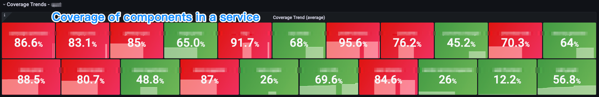
	- In year 2021, we found that the improvement of test coverage is stalled in some projects and thus we introduced new practices focus on the 'new' code coverage. And this was also the moment we move metric dashboards into Grafana.
- #### 
  Practices for new code coverage
	- Most importantly is to define threshold limit value for** new code coverage** in Sonarqube quality gate as part of PR review check. Check the blog '[why quality on new code matters?](https://blog.sonarsource.com/clean-as-you-code)' to find out more and follow the '[The boy scout rule](https://engineering.linecorp.com/en/blog/effective-code-review/)', developer has to be responsible for his (new) code (not legacies from others) and these new code coverage metrics make reviewer easily to check quality of the new code when performing code review.
	- You can found details from screenshots below, in our Grafana code quality dashboard:
	  First, we collected and monitored the distribution of new code coverage from each pull request, as long as developer comply with the rules above, do not merge the code if the new code coverage is low. With the dashboard below, it's easy to monitor the execution status in each service or project.
	  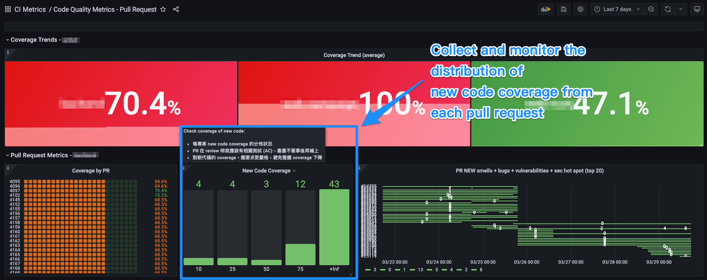
	- As we also found, when new code coverage is low for the most of the pull requests, then not surprisedly, the overall coverage is gradually getting lower.
	- 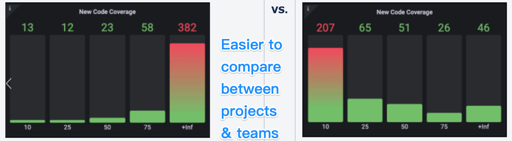
	- In Github pull request page which is integrated with sonarQube:
	- 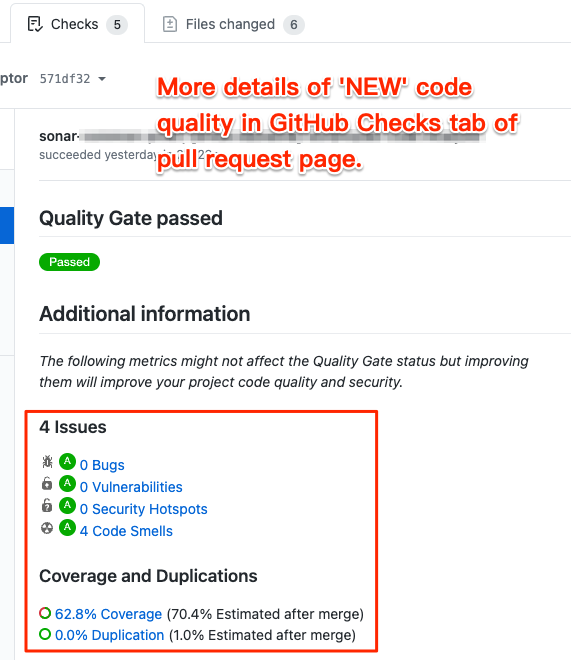{:height 525, :width 421}
	- |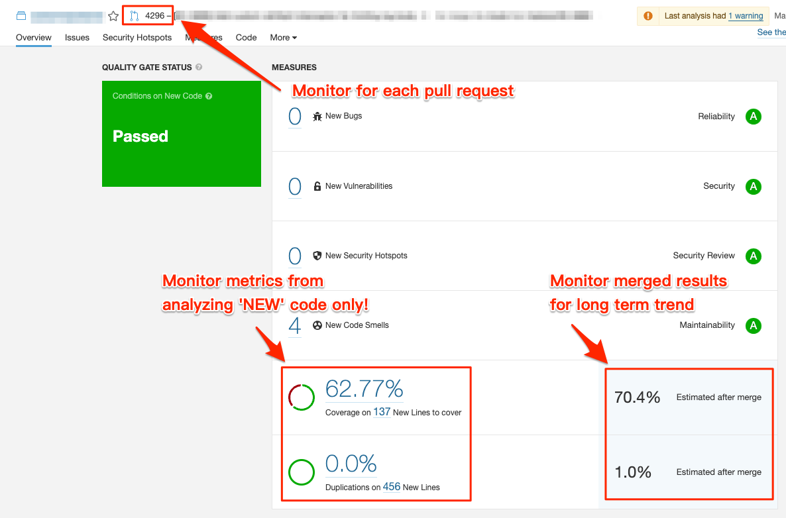{:height 174, :width 388}|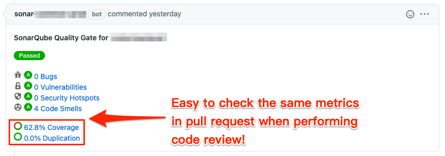{:height 182, :width 344}|
	- We also monitor long term trends of these quality metrics and promote the most improvement projects monthly.
		- 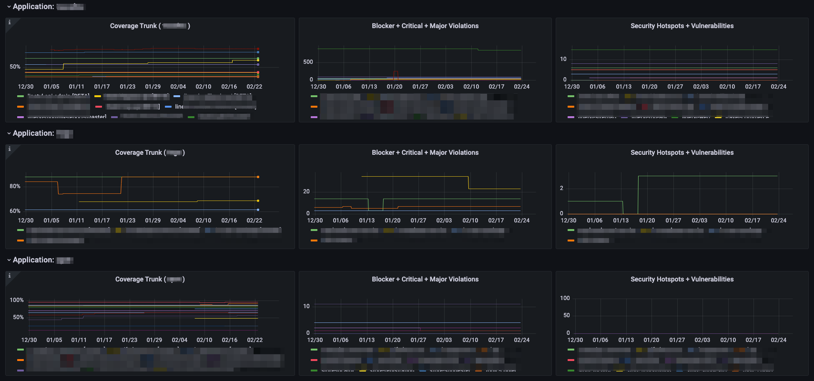
- ## Updates from the Year of 2023
	- ((65103e74-d3ce-478f-8e76-c904e59a3cdd))
- ### Reference
  * [Gerrit] [Code Review - Contributing](https://gerritcodereview-test.gsrc.io/dev-contributing.html#code-organization)
  * [Phabricator] [Writing Reviewable Code](https://secure.phabricator.com/book/phabflavor/article/writing_reviewable_code/)
  * [Phabricator] [Differential User Guide: Test Plans](https://secure.phabricator.com/book/phabricator/article/differential_test_plans/)
  * [MSFT] [Code Reviews and SW quality, Empirical Research Results](https://www.linkedin.com/pulse/code-reviews-software-quality-empirical-research-results-avteniev/)
  * [Cisco] [Best Practice for Code Review](https://smartbear.com/learn/code-review/best-practices-for-peer-code-review/)
  * [Book] [Accelerate: The Science of Lean Software and DevOps](https://www.amazon.com/Accelerate-Software-Performing-Technology-Organizations-ebook/dp/B07B9F83WM)
  * [Drive] [The Surprising Truth About Motivating Others](https://www.danpink.com/books/drive)