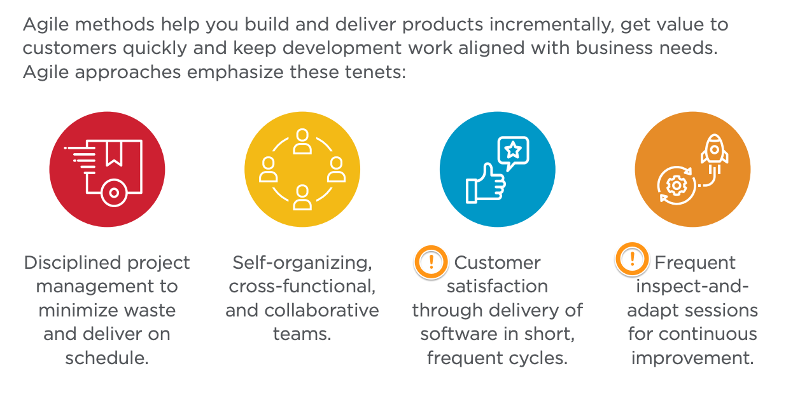

- Subtitle: 是在快三小？到底是別人有問題還是我們誤解了什麼？
- # Roundtables
- # Summary
- # Methodology
	- ## Agile Methodologies
		- 
			- Source: Rapid, Broadcom software.
		- Emerging flavors of agile—including test-driven development, behavior-driven development and set-based engineering address the specialized needs of the broad range of users now employing agile approaches.
		- #+BEGIN_QUOTE
		  “Delivering high-quality end products quickly requires new ways of working, including agile development, rapid release cycles, automated testing and deployment and a ‘test and learn’ approach to changes.”  ~ McKinsey
		  #+END_QUOTE
- # Reference