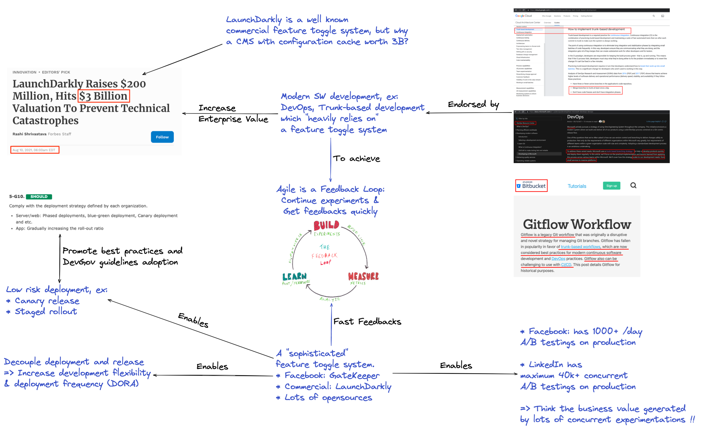
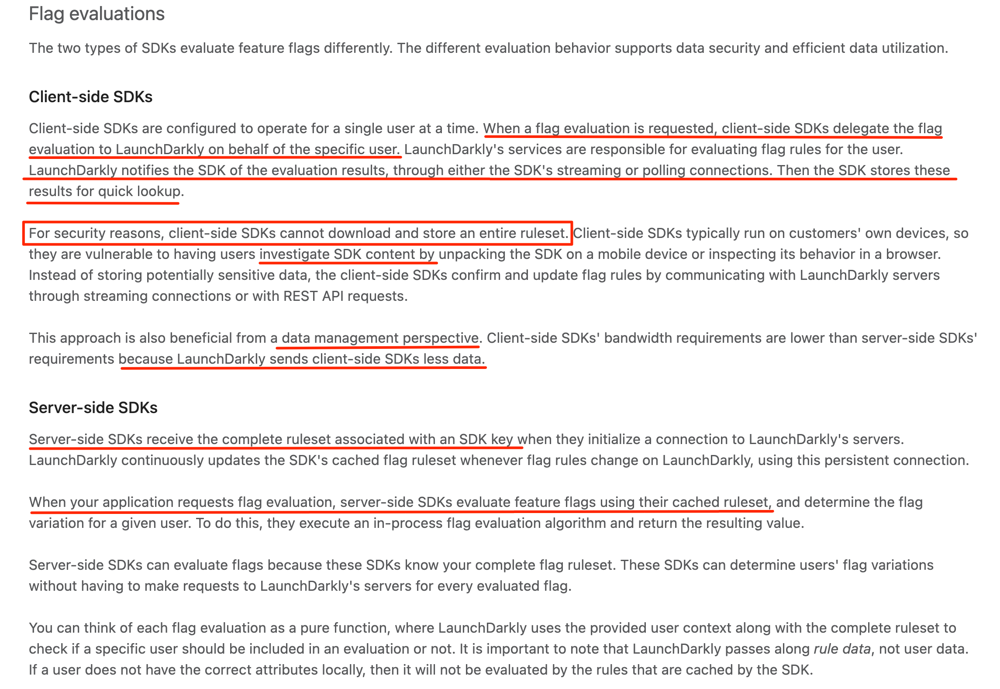
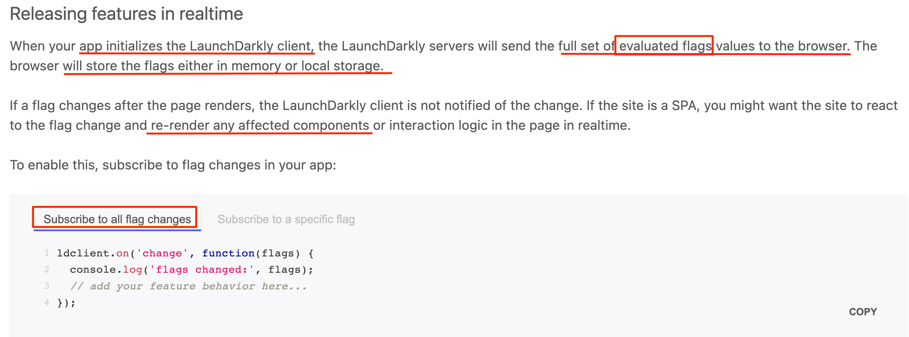
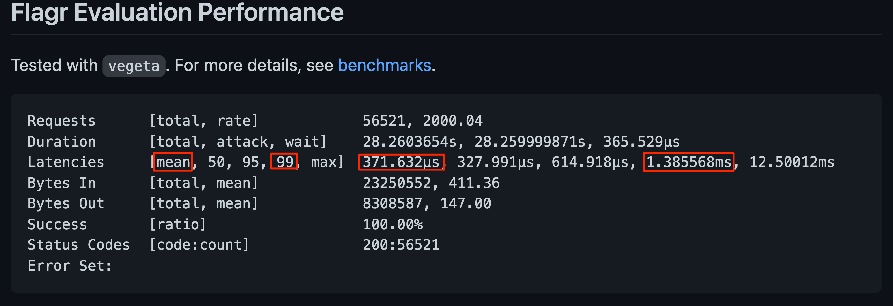
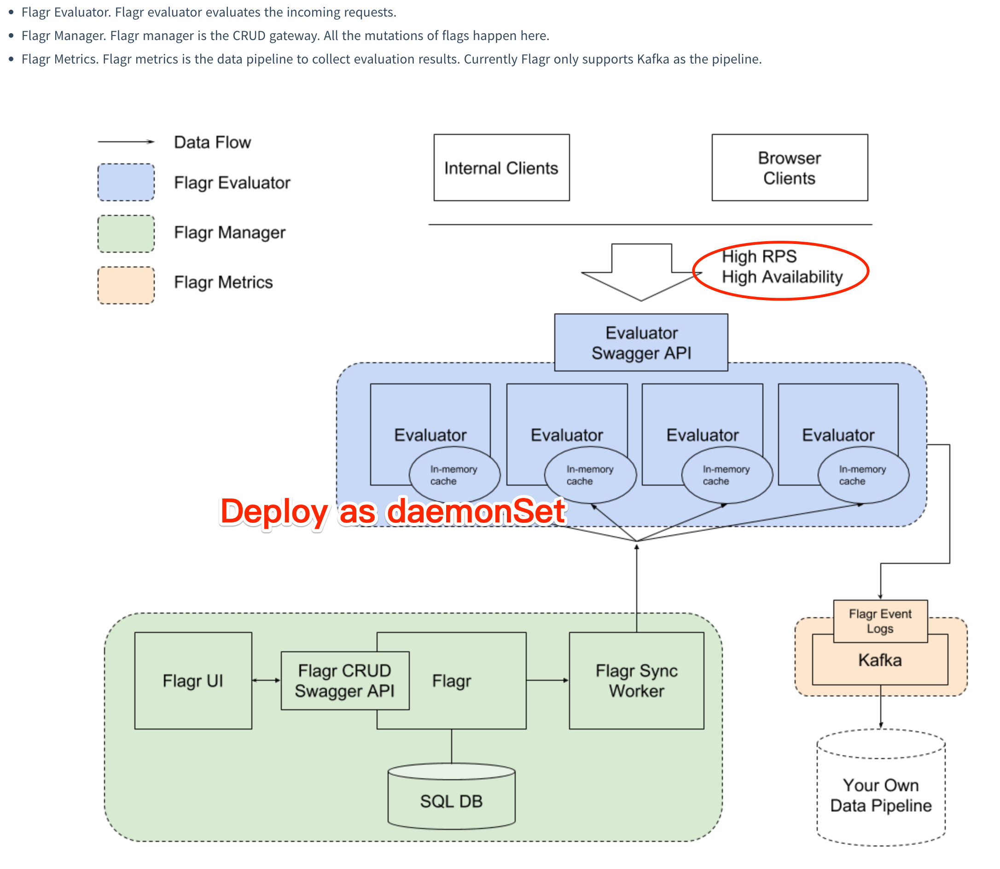

- 概圖
  
- 考量
	- ## Client side evaluation is the way?!
	  In case client attributes were sent to a 3rd-part service.
	  
	- ### Security concern when using client side evaluation
	  
	- ## Consideration
	  * Make sure latency is acceptable
	  * Evaluate once than store in header/cookies/local storage
	  
	  https://docs.launchdarkly.com/guides/flags/static-sites
	  > In most cases, ==using local storage might be enough== for most sites. Depending on how complex your site is or whether your page is generated or rendered on the server, you may be able to ==take advantage of bootstrapping== using server-rendered content.
	  
	  
	  
	  > The client initialization connects to LaunchDarkly's servers and fetches the initial flag values for the user. ==This initialization cycle can take around 100-200ms== and can delay your initial page render by at least that much. You could render the page before you have the flag values available, however, your users may experience parts of the page changing as the flag values load.
	- ## Revisit Openflagr
	  As the latency is very low, is it possible to have client evaluation below 200ms?
	  
	  