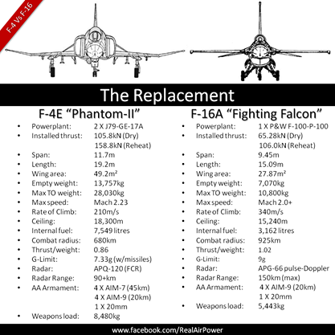
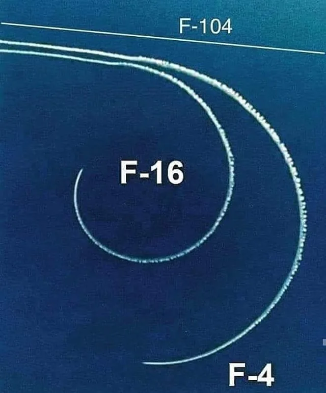

public:: true

- 前言：在核戰略的發展思路下，超音速突防的戰略轟炸機F-105、兼具空中截擊功能的遠程轟炸機F-4、正在研發中的第三代高機動多用途戰鬥機F-15——全部是20噸以上具備攔截和地面攻擊能力的重型戰鬥機——所組成的機隊是美國空軍的「天選之子」。
  1964年，派出F-100、F-4、F-105出征越南的美國空海聯軍勢在必得。而讓人大跌眼鏡的是，掛滿炸彈的F-105卻屢屢被毫無速度優勢的俄制MiG-17利用低速機動性連續擊落。
  1966年，剛剛服役並火速進入戰場的MiG-21更是利用輕巧靈活的機動能力在近距格鬥中大敗F-4，兵敗越南的美國空軍飛行員甚至沮喪地說「全世界最爽的飛行員就是河內的MiG-21飛行員」。
  回顧整個越南空戰，雖然美軍掌握了越南戰場上的制空權，但卻為此付出了沉重的代價。從1965年至1968年，僅在北越的空戰中，美軍就有918架飛機被擊落，並有818名機組人員罹難。戰前模擬評估中占據絕對優勢的F-4在實際戰鬥中和MiG-21的交換比竟然一度只有1:2，這讓美國空軍高層陷入了來自空軍各級軍官的質疑和深度的自我懷疑中，不得不重新思考下一代戰鬥機的發展思路。1972年1月，美國空軍正式提出新型戰鬥機的研製計劃，目的是驗證在戰鬥機上採用新技術，並沒確定要發展一個投產型號。==當時其主要技術要求是最大飛行速度M2，升限18000米，在9000米高度從M0.9加速到M1.5所需時間不超過1分鐘==，在12000米高度、速度為M0.9時的過載為3-4G，飛機的==體積小、重量輕==、價格便宜。 #原始需求
- 故事：由於F-4在越戰時的空戰表現不佳，特別是在近距離纏鬥的情況下，因而催生出F-15。他們批評F-15的體型太大而且成本太高。戰機黑手黨主張應該要研發一種具備極高運動能力的輕型戰鬥機，同時採購成本低廉，能夠大量部署。這些特性也就成為1971年開始進行的輕型戰鬥機計畫 (LWF)。輕型戰鬥機以敏捷性為最高原則，其規格為一架標準空戰重量為20,000英磅（9,100公斤）的設計，這個重量僅有F-15的一半。此外非常強調低成本，小體型，航程遠，以及==機動性，包含迴轉率和加速率，但是不必追求高速==。這架飛機的最佳操作環境是在==低於1.6馬赫和40,000英尺（12,000公尺）==以下的高度。
  
  初代F-16的特點和性能：
  * __出色的機動性能__
    * 先進的氣動外形： F-16A/B的氣動外形被認為是翼身融合做的最好的戰鬥機，有效降低飛行過程中產生的阻力。
    * 動力強大的發動機裝置：最大推力106kN，在飛機油箱全部裝滿情況下，推重比達到1:1，也是第一種能夠進行9G過載機動的戰鬥機。
    * 先進的飛控系統：F-16是第一種投入批量生產的==電傳操縱飛機==，也是依靠電傳飛控系統的有效控制，F-16得以用前無古人的負穩定氣動設計實現更高的機動性能。
  * __均衡的任務執行能力__
    * 先進的火控系統
    * 逐步提升的掛載能力
    * 出色的航程
  * __合理的人機互動__
    * 出色的飛行員視野：==泡狀座艙罩==採用無框衍設計，不像一般有框衍座艙罩會影響飛行員視野。
    * 體貼的人體工學設計： F-16的==座椅是30°斜躺；飛行控制杆是安裝在右手邊上==，而非傳統的在兩腿之間，用來輔助在高過載時候轉彎。
  * __合理的價格__
- 作為世界上最成功的一款第三代戰鬥機，洛克希德·馬丁與他的F-16一定是角逐「GOAT」（Greatest Of All Time）的最大熱門。單看其簡歷，綽號「戰隼」（Fighting Falcon）的F-16就儼然是星光熠熠：
  * 世界上生產交付數量最多的第三代戰鬥機：累計生產交付超過4602架（訂單數量超過4700架）；
  * 世界上現役數量最多的第三代戰鬥機：現役超過3000架；
  * 世界上用戶國家最多的第三代戰鬥機：29個用戶國家；
- ==Summary==
  令人印象深刻是F-16戰鬥機，它的最初的設計需求是飛行速度要達到2-2.5馬赫，首席設計師 Hillaker 詢問美國空軍為何需要如此快的飛行速度，答覆是「飛機必須能從戰鬥中逃脫」。然而，意外的是，Hillaker 的最終設計並沒有達到2馬赫，但通過無框氣泡式坐艙蓋、傾斜的座位、側裝式控制杆等等諸多創新技術，飛行員可以非常敏捷地從戰鬥中逃脫，並且這樣的設計生產成本更低！看似明晰的「2.5馬赫」並未有效地傳達真正的需求，那只是一種解決方法，Hillaker 通過理解真正的需求而給出了更好的設計，這是成功產品設計的本質！最後當Hillaker 被問及對新一代戰鬥機設計師們最大的挑戰是什麼？他的回答是：溝通。原文網址：[https://kknews.cc/news/4x6nxv3.html](https://kknews.cc/news/4x6nxv3.html)
- ## Reference
- [Wikipedia](https://zh.m.wikipedia.org/zh-hant/F-16%E6%88%B0%E9%9A%BC%E6%88%B0%E9%AC%A5%E6%A9%9F)
- 原文網址：https://kknews.cc/military/6rznan3.html
- 
-  
  source: [9GAG](https://9gag.com/gag/aoPje42)