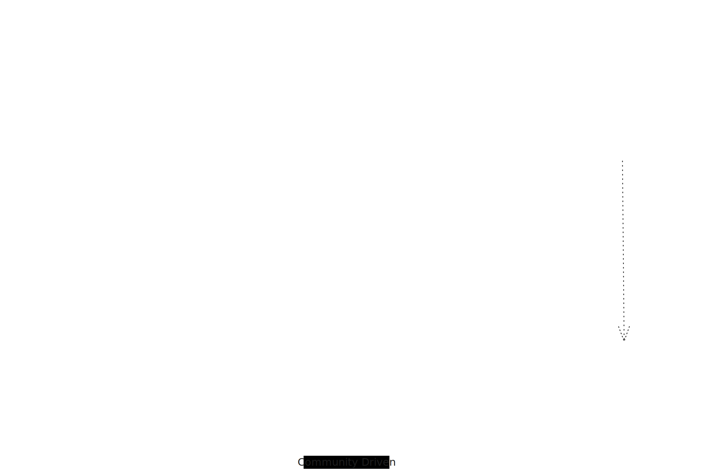

public:: true
type:: blogpost

- ## Tech Planning
   {:height 528, :width 780}
- ### 目標
	- 大規模敏捷組織中，通過建立公會等組織形式，為跨團隊的共同決策過程提供制度化的支持，加速決策的形成和落實，並鼓勵和支持跨團隊的影響力工作，讓不同職能和背景的成員能夠有效溝通和協作，共同推進組織目標的實現。
	  
	  1. 知識共享：在^^跨團隊^^之間建立有效的知識共享機制，確保組織內部的最佳實踐和經驗能夠得到有效傳播和複製。
	  2. 協議（決策）開發策略：建立^^跨團隊^^協作的決策機制，制定統一的開發策略、減少技術棧碎片化，提高整體系統的一致性和可維護性來提高 DevOps 和 SRE 的支援效率。
	  3. 平台工程： 建立內部開發平台與工具 (incl. SW templates) 加速制度化與標準化，支持公會所發佈的 golden paths.
- ### 行動
	- #### Architechture Review Board
	  * Architecture review with RFC (supplement with ADRs)
	- #### Purposes of   `Guild`   for each domain
		- Each guild has authority to define engineering guidelines and practices 
		  * Maintain process, techdoc templates
		  * Suggest courses for career path
		  * Setup Golden paths and onboarding guide
		  * Host periodical meeting to review above agenda and Tech Radar
	- #### Suggestion of topics
		- General practices
			- Onboarding guide and collect onboarding time metrics
			- Mock server tooling and practice guide
			- Test isolation - testContainers, mock server, CDCT
				- [Here](https://github.com/pofengliu/test-isolation-demo) to demo three levels of test isolation for parallel auto testing and pipeline stability
		- DevGov
			- SonarQube profiles and periodically review
			- Dependency and vulnerability management
			- How to store credentials
		- Tech stack planning with Tech Radar
			- Collective intelligence over personal/team preferences
			- Pay attention to tech trend shift
	- #### Platform & Tooling
	  * Docs as Code: including ARD and RFC, to enable knowledge authoring and sharing
	  * Backsage: a developer portal, for each guild to publish discussion results and practices
	  * Tech Radar: increasing transparency of tech decision making progress
- ## Reference
	- [Software Engineering RFC and Design Doc Examples and Templates](https://newsletter.pragmaticengineer.com/p/software-engineering-rfc-and-design)
- ## Community Setup
	- 在這為每個領域 (domain) 成立的組織, 是否稱作 ＂committee＂ 比 ＂community＂ 合適呢？
	- ### 主要特徵
	  * 自願參與：guild 是一個自願參與的社群，成員來自不同的 squads（小組）、tribes（部落）和 chapters（章節）。
	  * 多樣性：guild 涵蓋各種興趣和技能，包括業餘愛好（如自行車、攝影）和工程相關的領域（如 web 開發、後端、C++ 工程）。
	  * 跨組織協作：guild 超越了正式結構，聯合了擁有共同興趣的成員，促進了跨團隊和跨地點的協作。
	  * 自主組織：guild 活動由協調人主導，但最終目的是實現自我組織，減少對協調人的依賴。
	  * 多樣化的活動：guild 活動多種多樣，包括 Google 群組、Slack 頻道以及年度共地化會議（如 unconference）。
	- ### 成功因素
		-  
		  * 清晰的目標和價值：
		      * 明確定義 guild 的目標和期望價值，確保成員對目標有共同的理解，並讓這些價值被管理層認可。
		  * 積極參與：
		      * 確保成員能夠在 guild 工作中投入足夠的時間，這可能需要來自組織的支持。(20% for side-project)
		      * 推動成員積極參與 guild 的活動，使用 Slack、Google groups 等工具促進日常互動。
		  * 定期互動：
		      * 定期舉行面對面會議和線上互動，確保成員之間的持續聯繫。
		      * 舉辦年度共地化會議（ unconference ）來增進成員間的交流和討論。
		      * 進行定期檢查（回顧）以評估 guild 的目標和實際價值，並根據需要進行調整。
		  * 組織支持：
		      * 得到組織的授權 (authority)、支持和資助，確保有足夠的資源和時間投入。
		  * 跨地點合作：
		      * 有效管理跨地點的成員，克服地理和時間上的挑戰，促進跨地點的知識分享。
		  * 核心成員的引導：
		       * 有核心成員或協調人來引導和支持其他成員，特別是在初期階段。
	- ### 參考來源
		- [Spotify Guilds – Cultivating Knowledge Sharing in Large-scale Agile Organizations(https://ieeexplore.ieee.org/document/8648260
		- Tech Radar 環的[定義](https://www.thoughtworks.com/radar)如下：
			- 採納 (Adopt)。我們認為團隊應該認真考慮使用的點。
			- 試驗 (Trial)。我們認為可以放心使用的點，但還沒有達到「採納」環中那麼成熟的程度。
			- 評估 (Assess)。值得關注的點，但除非非常適合您的需求，否則目前可能不需要試用。
			- 暫緩 (Hold)。需要謹慎對待的點。