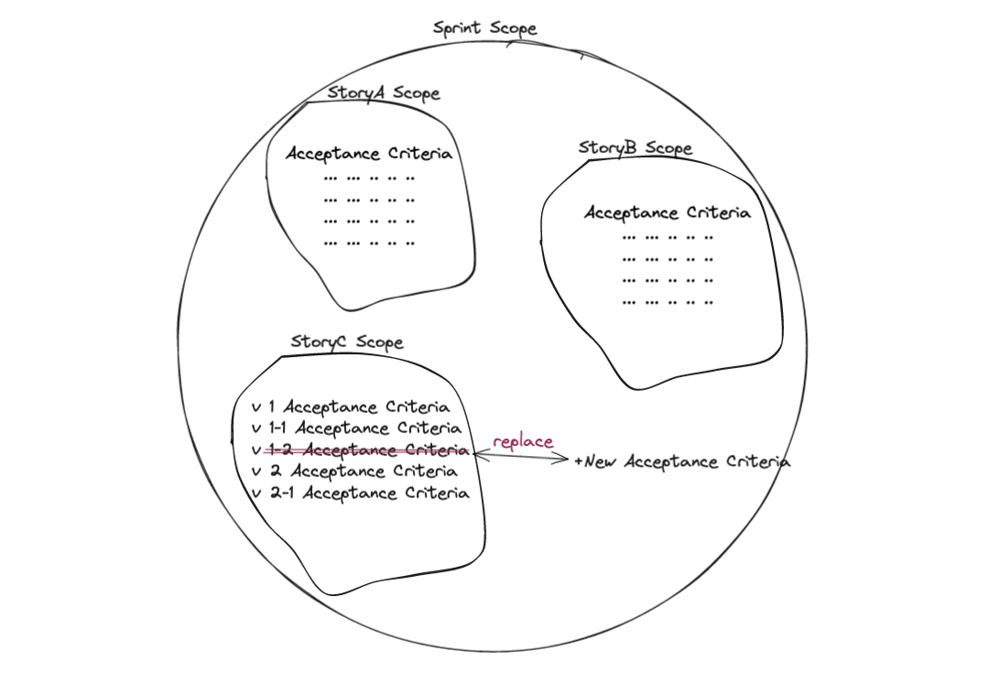

- 
- 
  常發生的情況是，當 coding 開始後，才發現有使用者用例是當初沒想到的。但由於 Sprint points 已經估滿，此時 PM 通常會讓 RD 加班把用例補上。所以在 PBR 會議時，能把重要用例 (Key Examples) 詳列出來且針對討論出來的用例去估點，才能讓估出的點數更加精確。或許這時應該拿之前討論的結果問問 PM ，如果新用例比較重要，是否能把某些較不重要的用例先拿掉或移去下個週期呢？而不是全部都硬吃下來，狂加班的結果也勢必影響或壓縮後續測試的時間 (Quality)!
- #+BEGIN_NOTE
  PBR 會議中討論並找出 Key Examples，目的並不是要==完善所有需求== (Complete Spec)，而是要==定義出 Story 的範圍== (Define Scope)!
  #+END_NOTE