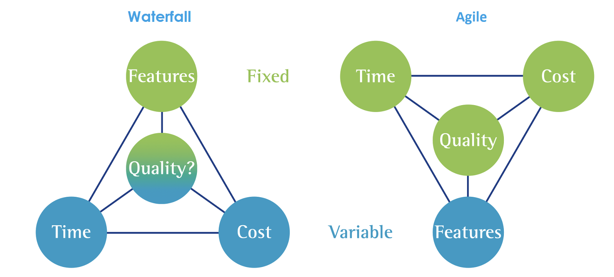
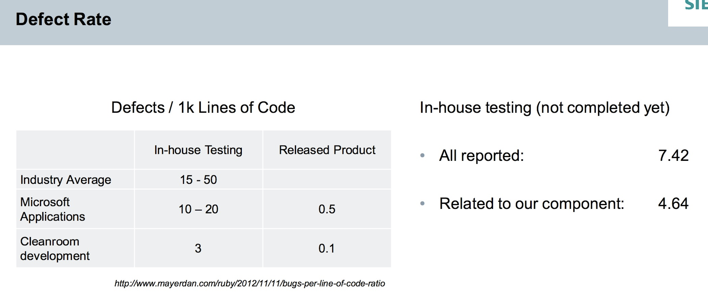

public:: true

- ## About Scope
	- 
	  Figure. Why defining scope is important in agile
	- 常發生的情況是，當 coding 開始後，才發現有使用者用例是當初沒想到的。但由於 Sprint points 已經估滿，此時 PM 通常會讓 RD 加班把用例補上。所以在 PBR 會議時，能把重要用例 (Key Examples) 詳列出來且利用討論出來的用例再回去驗證當初所推估的複雜度，才能讓估出的點數 (user story points) 更加精確。或許這時應該拿出之前討論的結果 (scope) 問問 PM ，如果新用例比較重要，是否能把某些較不重要的用例先拿掉或移去下個週期呢？而不是全部都硬吃下來，狂==加班的結果也勢必影響或壓縮後續測試的時間 (Quality)==!
- ## About Quality
	- CASE I: [Specification by Example, 10 years later](https://gojko.net/2020/03/17/sbe-10-years.html)，內有說明 ==SbE 書籍相關論述==十年後社群調查的結果！
	- CASE II: Cleanroom development
	   
	  We applied:
	  * Specification by Example 
	  * Acceptance and extensive Unit Testing 
	  to avoid technical debt in late phases of the project 
	  * ==Used Defect Rate as performance indicator==
	  * Methodology mix worked well for us (very low Defect Rate) 
	  * Planning to roll-out on broader scale