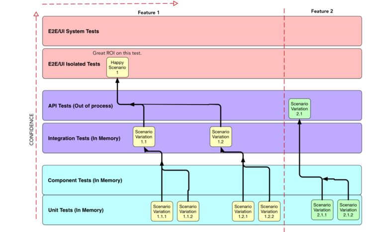

- 當前要解決的問題：
- {{embed ((6367b949-a858-42b9-ab53-89a8bf46ed02))}}
  
  如果說，自動化測試做太多是適得其反的，那麼到底什麼才是自動化測試的標的呢？ 我想這邊有三個重點：
  1. 團隊能了解自動化測試的內容
  2. 區分＂關鍵實例＂及＂一般測試案例＂的差別及做到分層自動化測試
  3. 最後才是如何做才能讓測試==跑得快且跑得穩==
- ## 團隊能了解自動化測試的內容
	- 自動化測試唯一的目的就是要 delivery pipeline 中驗證交付項目的質量是否達到可交付的標準。就如同我們在[實例化需求](((6367b951-ebca-40fa-ab91-2b2496ce105a))) 文章中所提到的：
	  1. 全部 feature team 人員與 planner 一起討論出驗收條件 (Acceptance Criteria)
	  2. 確認開發人員把 AC 做成自動化測試視為專案的 DoD
	- 高質量測試的來源：
	  #+BEGIN_QUOTE
	   “As Seb Rose appropriately remarked, if we have lots of tests, does that automatically mean we have the right tests? Obviously, no. ==Many tests do not mean high-quality tests.== It could be we have lots of tests but little feedback because they test the wrong things. Or we have few tests but excellent feedback because they test the precise right things. ==A good mix of roles (Product Manager, Test Engineers, Software Engineers, Operations Engineers, UX Designers) together with Example Mapping should ensure the correct things get tested.== ”                           ~ [ThinkingLabs: The Practices That Make Continuous Integration](https://thinkinglabs.io/articles/2022/09/28/the-practices-that-make-continuous-integration-building.html)
	  #+END_QUOTE
	  唯有全員一起討論才能對 goal & scope 有一樣的共識，知道重要的使用者行為及商業邏輯都有被列入 AC 驗證的範圍，另外利用 DoD 的規範來確認這些重要的案例都有被自動化測試所涵蓋並成為 CI pipeline 回歸測試的一部分。
	- 另外如何讓測試覆蓋 (Test Coverage) 不重複，可參考：
	  
	  建議可以看看這篇 [A Pipeline Friendly Layered Testing Strategy by Roy Osherove ](https://pipelinedriven.org/article/a-pipeline-friendly-layered-testing-strategy-amp-recipe-for-dev-and-qa)，節錄重點：
	  * Discovery Work is a Team Work:  Before starting to code a feature or a user story, the developer sits with another person to create a “Test Recipe”. That other person could be another developer, a QA person, an architect, or anyone else ...
	  * Creating Test Recipe: At its core it’s a simple list of 5-20 lines of text, detailing simple scenarios to be tested in an automated fashion and at what level.
	   
-
- ## 關鍵實例 V.S. 一般測試案例
-
- ## 如何做自動化測試
	- 我們必需有個工法(methodologies) 讓團隊能重複去實作自動化測試來確保達到以下的目的，而非讓大家自由發揮！
- ## 最後
  既然大家都做了幾年並發現結果並不是很理想，為何不試試新的方法呢？What can you lose?