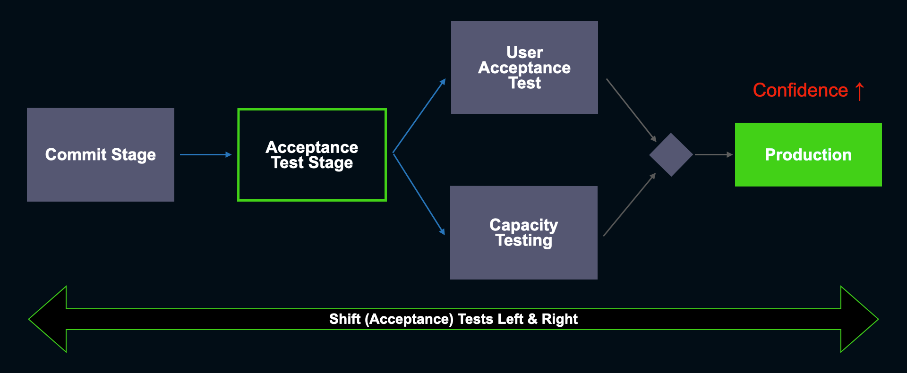
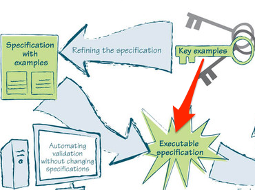
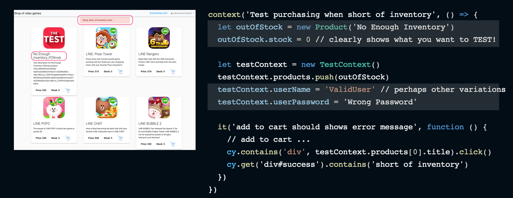

public:: true
type:: blogpost

- 
- #+BEGIN_PINNED
  當前要解決的問題：
  * 自動化測試跑太多、太久、維護成本高
  * Flaky 且無法高度 parallel 去執行
  * 測試內容太多，沒人真正清楚 test coverage 和沒有被 cover 的部份
  * RD 進 code，AE 的 integration test automation 就容易 fail 掉 (pipeline 紅紅綠綠，Non-deterministic)
  * Pipeline 跑完還是沒有信心直接佈署到 production
  #+END_PINNED
- {{embed ((6367b949-a858-42b9-ab53-89a8bf46ed02))}}
  
  如果說，自動化測試做太多是適得其反的，那麼到底什麼才是自動化測試的標的呢？ 我想這邊有三個重點：
  1. 團隊能了解自動化測試的內容
  2. 區分＂關鍵實例＂及＂一般測試案例＂的差別
  3. 以分層自動化測試避免 Test Coverage Duplication
  在能達到「驗證品質目的」的前提下，自動化測試的案例越少越好 (降低成本)最後才是如何做才能讓測試==跑得快且跑得穩==
- ## 團隊能了解自動化測試的內容
	- 自動化測試唯一的目的就是要 delivery pipeline 中驗證交付項目的質量是否達到可交付的標準。就如同我們在[實例化需求](((6367b951-ebca-40fa-ab91-2b2496ce105a))) 文章中所提到的：
	  1. 全部 feature team 人員與 planner 一起討論出驗收條件 (Acceptance Criteria)
	  2. 確認開發人員把 AC 做成自動化測試視為專案的 DoD
	- 高質量測試的來源：
	  #+BEGIN_QUOTE
	   “As Seb Rose appropriately remarked, if we have lots of tests, does that automatically mean we have the right tests? Obviously, no. ==Many tests do not mean high-quality tests.== It could be we have lots of tests but little feedback because they test the wrong things. Or we have few tests but excellent feedback because they test the precise right things. ==A good mix of roles (Product Manager, Test Engineers, Software Engineers, Operations Engineers, UX Designers) together with Example Mapping should ensure the correct things get tested.== ”                           ~ [ThinkingLabs: The Practices That Make Continuous Integration](https://thinkinglabs.io/articles/2022/09/28/the-practices-that-make-continuous-integration-building.html)
	  #+END_QUOTE
	  唯有全員一起討論才能對 goal & scope 有一樣的共識，知道重要的使用者行為及商業邏輯都有被列入 AC 驗證的範圍，另外利用 DoD 的規範來確認這些重要的案例都有被自動化測試所涵蓋並成為 CI pipeline 回歸測試的一部分。BTW，AC 到底包含些什麼？ ((62c6830f-4c9c-4fe7-b5e0-a68ba8eb4c1e))
	- 在不同的 pipeline 階段，自動化測試項目的目的應該不同：
	  * Build stage: 在 PR 階段，大部分的 AC 案例應該要可以在這階段跑完，因為 AC 為已知的驗收條件 (Story DoD)。此時的自動化應該利用大量的 mock, stub 和 testContainers 等完成大部份 AC 的測試案例。盡量避免連結真正的 3rd-party API 或 database，因為在這階段只有你自己的代碼才能夠 fail 你的 pipeline。(stability **↑**)
	  * Smoke test stage: 在 commit & build stage 後，artifacts 應該會被佈署到 beta 或直接上到 staging 的環境。次時應該執行 ==smoke tests，這邊的案例應該專注於 end-to-end 的重要 CUJ (critical user journey) 及跟真實 3rd-party 的 integrated transactions.==
	  P.S. 團隊應該要持續維護一份服務的 CUJ 文件，每當有重要的功能上線後，如有必要就應該回來修改這份文件！
- ## 關鍵實例 V.S. 一般測試案例
	- 在實例化需求的 Key Process Pattern 中已經闡明，自動化測試的標的是關鍵實例而非一般的 raw examples.
	  
	- 但是什麼才是 Key Examples？
	  {{embed ((62c68310-faf2-4936-8b46-fdd9916c9945))}}
	- ## 以分層自動化測試避免 Test Coverage Duplication
		- 另外如何讓測試覆蓋 (Test Coverage) 不重複，可參考這篇 [A Pipeline Friendly Layered Testing Strategy by Roy Osherove ](https://pipelinedriven.org/article/a-pipeline-friendly-layered-testing-strategy-amp-recipe-for-dev-and-qa)：
		  
		  重點節錄：
		  * Discovery Work is a Team Work:  Before starting to code a feature or a user story, the developer sits with another person to create a “Test Recipe”. That other person could be another developer, a QA person, an architect, or anyone else ...
		  * Creating Test Recipe: At its core it’s a simple list of 5-20 lines of text, detailing simple scenarios to be tested in an automated fashion and at what level.
		  * Test Recipe is NOT: (x) A list of manual test cases, (x) A complete and exhaustive list of all test permutations and possibilities
		  意思也是團隊一起討論並收斂為關鍵實例，再來 RD 針對每個實例去討論如何==利用不同階層自動化測試的特性，去滿足實例的驗收，期望以最少的 test cases 卻能達到最高的信心度。==避免在不同層級的測試中，針對相同的邏輯編寫測試案例！
		  > **「在實作成本最低的測試層級上，進行相應業務邏輯的測試」**
		- 
- ## 如何做自動化測試
	- 
	- 我們必需有個工法(methodologies) 讓團隊能重複去實作自動化測試來確保達到以下的表準，而非讓大家自由發揮！(TODO 另外文章解釋)
	  * Three levels of test isolation
	  * TestContext and defaultObject
	  * Consumer driven contract test & TestContainers
	  * Other test practices for stabilities
- ## 最後
  既然大家都做了幾年並發現結果不是很理想，何不試試新的方法呢？
- ==Must read and inspiring: [Write tests. Not too many. Mostly integration.](https://kentcdodds.com/blog/write-tests)==