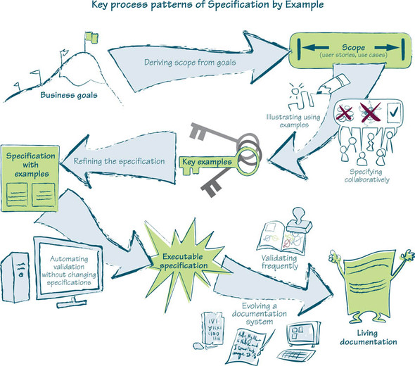
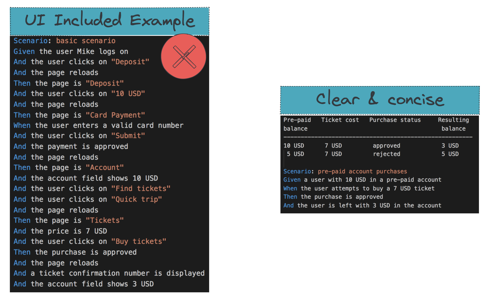

title:: 實例化需求 (Specification by Example)/2.Key Process Patterns
public:: true

- title:: 實例化需求 (Specification by Example)/Key Process Patterns
- 
- ## 從目標中獲取範圍 (Deriving scope from goals)
  團隊以客戶的業務目標開始，經由協作了解背後的價值並界定預計達成的目標範圍，產生使用者故事 (user stories) 並且能簡單舉例 (high level examples) 說明之。
- ## 協作制定需求規格 (Specifying Collaboratively)
  SbE 的重點之一，經由團隊的共同討論 (face-to-face with whiteboard) 並探索出最佳解法 (solutions)。
  
  Figure. Illustrating specifying collaboratively, by Gojko and Jeff Patton & Associates
- ## 關鍵實例 (Determine Key Examples)
  id:: 62c68310-faf2-4936-8b46-fdd9916c9945
  團隊成員通過工作坊的方式制定需求規格，通常來說，先用實例來描述，推測一些規律，轉成用表格表達，可能發現更準確的規律。
  #+BEGIN_QUOTE
  Every acceptance criterion generates new examples; every example generates new scenarios. Teams should refine their specifications to merge similar examples, reject the ones that introduce noise, and choose the most meaningful or descriptive ones.
  #+END_QUOTE
	-  
	  Reference: [《Writing Great Specifications》](https://livebook.manning.com/book/writing-great-specifications/chapter-1/point-15744-257-257-0) and [《Fifty Quick Ideas To Improve Your Tests》](https://gojko.net/2014/05/05/focus-on-key-examples/)
	- #+BEGIN_TIP
	  Complex specifications
	  * ==Don’t invite discussions==
	  * Technical model is misaligned with the business model
	  * Described at the wrong level of abstraction
	  * ==Usually means refining a story isn't done==
	  #+END_TIP
	- #+BEGIN_TIP
	  Key examples
	  *  A small number of relatively simple scenario
	  * ==Easy to evaluate and argue about boundary conditions==
	  * Easier to discover and resolve inconsistencies
	  * (raw examples won't provide above two advantages)
	  * Right level of abstraction to describe situation better
	  * Satisfy business needs faster
	  * Modularized software reduces future maintenance costs
	  #+END_TIP
- ## 精煉需求規格 (Refining the specification)
	- 需求規格應該是精確、能被驗證、不言自明並且是跟商業規則有關係的。承上信用卡清算案例，一個明確的需求規格如下：
	  {:height 1390, :width 1217}
	  Reference:  [《Fifty Quick Ideas To Improve Your Tests》](https://leanpub.com/50quickideas-tests)
	-  
	  Reference:  [《Fifty Quick Ideas To Improve Your Tests》](https://leanpub.com/50quickideas-tests)
	  ==思考點：當預付點數只剩 6.95 元，但票價要 7 元時，你買還是不賣這票呢？==
	- #+BEGIN_TIP
	   Good specifications
	  * Have a concise description
	  * Have a clear model
	  * Use business language
	  * ==Show a clear connection between inputs and outputs==
	  * ==Describe (focus on) WHAT not HOW==
	  * ==Avoid GUI specifics==
	  #+END_TIP
	- #+BEGIN_NOTE
	  * 別忘了，前面的關鍵實例或是這邊精煉過的需求規格，也正是這個 sotry 能帶進 sprint planning meeting 做討論的條件之一，因為它正符合了 story DoR 的 "checkable" 條件！
	  
	  #+BEGIN_QUOTE
	   Sprint 正式開始之前，每個團隊將至少擁有一至兩個故事，且各自具備已經對自動化做好準備的、詳細的、附帶實例的 spec。~Gojko Adžić @ 《Specification by Example》
	  #+END_QUOTE
	  
	  * Story candidate 應該具備 V.I.N.C.E. 條件 or INVEST (Definition of Ready)
	    * 有價值（Valuable）：對使用者的價值有被清楚的表明
	    * 可獨立（Independable）：沒有外部的相依性會阻礙這個story的完成
	    * 可協調（Negotiable）：提供足夠細節但容許後續討論與更動
	    * 可驗證（Checkable）： 所有驗收條件已經被清楚描述
	    * 可估計（Estimable）：估算過且應該可以在一個sprint內完
	  #+END_NOTE
- ## 進行自動化驗證 (Automating validation without changing specifications)
  id:: 62c68310-89c3-4e1e-9401-2410be84e7d9
  以自動化測試驗證實作標的來確保符合商業需求，實作 executable specifications 部份，後面章節會有相關程式碼展示。所以這些可被執行的規格文檔可用來說明程式的功能 (functionality) 與行為 (behaviors)，並針對當下的程式代碼檢驗規格的完整性 (compliance)。
  
	- #+BEGIN_NOTE
	  * 有了關鍵實例，是不是對實行 TDD 又更近了一步？
	  * What is unit test cases?
	    * (x) Test implementation details (app classes, functions, ...)?
	    * (x) 腦補的 test cases / user scenarios?
	    * (v) Cases to fulfill acceptance criteria?
	  * What is acceptance tests:
	    * Sum of key (available) features of the system
	    * Executable specifications
	  #+END_NOTE
	- #+BEGIN_CAUTION
	  從上一步驟你應該發現，自動化測試的目標為精煉過後的 key examples，沒錯就是＂關鍵實例＂！一般常見的錯誤印象就是 CI Pipeline 的 automation 就是要做好做滿，所有的手動測試案例都應該要變成自動化，這樣的 coverage 才會高，對 pipeline 的結果才會有信心 ，其實是適得其反 ... 最重要的其實是要把能闡述業務邏輯與行為的關鍵實例作自動化就好，並且要讓團隊了解 pipeline 執行的內容，清楚了解對於使用者最重要的案例都已經自動驗證過了，這才是 CI pipeline 信心的來源！
	  Reference: ((62ba9533-3e8b-4ed1-a3cd-1f8143878aae)) 
	  #+END_CAUTION
- ## 頻繁的驗證 (Validating frequently)
  每當有程式碼提交到版本管控系統，則觸發相關的 continuous integration pipeline 自動執行這些自動化測試，以確保系統符合業務目標。
  
- ## 演變為說明文件系統 (Evolving a documentation system)
  藉由不斷地更新需求規格 (specifications) 來反映商業邏輯上的變化，並演化成活的說明文件系統 (Living Documentation)。如何從規格文檔產生活文件，實作部份後面章節會有相關展示。