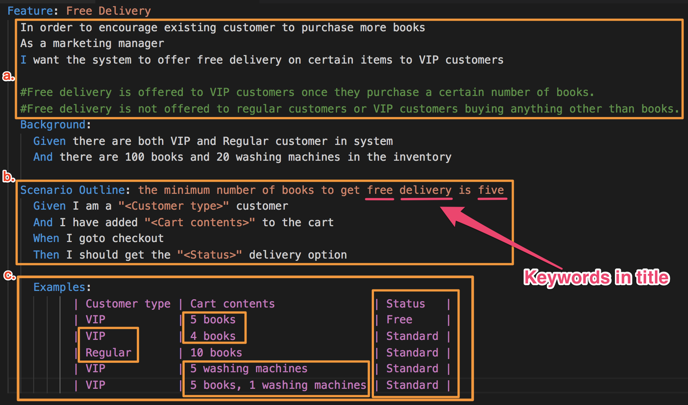

public:: true
title:: 實例化需求 (Specification by Example)/3.Gherkin How-to

- title:: 實例化需求 (Specification by Example)/Gherkin How-to
- ## How to Write Good Execution Specifications
  #+BEGIN_QUOTE
  “Tests should be regarded as requirements, and requirements as tests”             ~ Craig Larman - Specification By Example
  #+END_QUOTE 
  在大家嘗試寫出 story 的 AC 時，或許你已經試著用到 Gherkin (Given-When-Then) 的方法又或許你還不習慣，接下來我們來看看如何寫出好的 Gherkin 文檔。
- 範例：
  
- ### a. Story background & Rules：
  * <In order to achieve goal><As a customer role><I want feature of ...>
  * Description of business rules
  * Plain language with domain terms
- ### b. Scenario：
  * What's special about this example??
  * With short summary as the scenario title
  * Describe What not How (to implement / test)
  * Clear input / output (model)
- ### c. Examples：
  * Testable cases
  * Explicit values for relevant data (only) , no redundant data
  * Contrasting examples and counter-examples