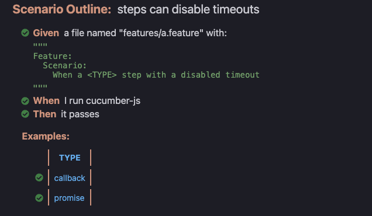
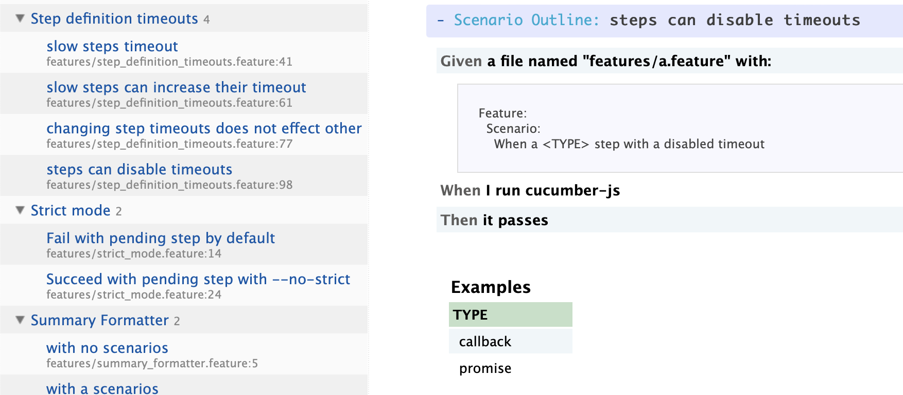

title:: 實例化需求 (Specification by Example)/5.Living Document

- #+BEGIN_QUOTE
  產品利益相關者 (stakeholders) 能夠經由文件系統查詢最新生產線上的商業邏輯，而不需要經由工程師去看代碼才能知道，那大概就做對了！
  #+END_QUOTE
- ## 以 Cucumber.js 為例
  把 Git project clone 下來後，只要執行完測試，便會在產生 "reports" 的目錄，下圖為檔案 "reports/html-formatter.html" 的截圖。
  
- ## 通用方法產生文檔
  一般看來 cucumber 還是以 Ruby 生態系支持比較完整，但因為 Gherkin 為公開的標準，只要你 feature file 的寫法符合標準，那麼你通常都可以：
  * 找到相對應自動化的框架： ex: spring boot, Cypress, Selenium
  * 轉成活文件的工具：在下段落介紹 (以 docker 為例)
  ### Yardoc
  
  