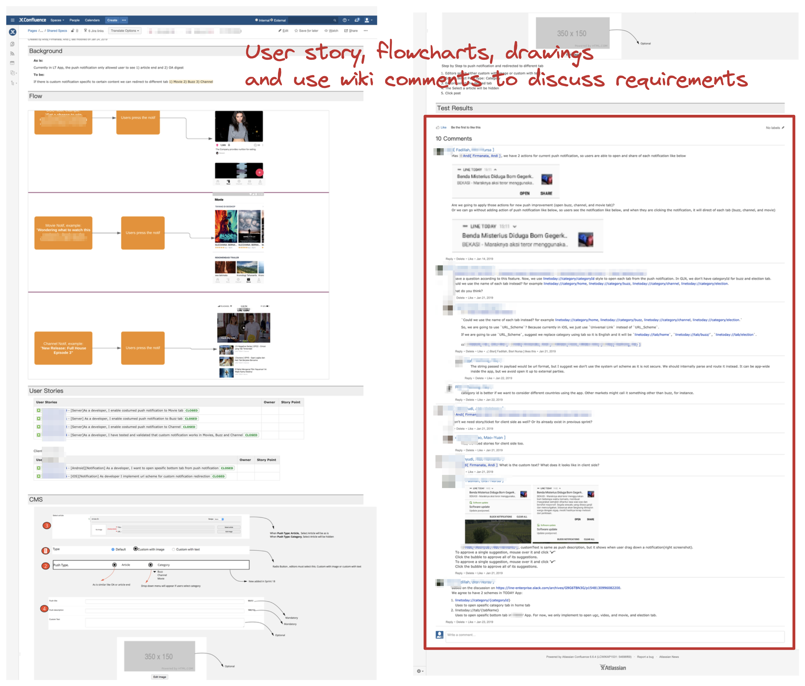

public:: true
title:: 實例化需求 (Specification by Example)/5.Reference Cases

- title:: 實例化需求 (Specification by Example)/5.Reference Cases
- {:height 332, :width 729}
- 
  #+BEGIN_NOTE
  Guys, doing SbE is NOT to list down all test cases (左圖), you should focus on:
  * Collaboratively: if PO prepares the AC, then the rest of team won't think hard if there is a better way to express the biz logic behind. The trick here is to ==think how to show the results table first== then rewind back to  figure out the given-when-then conditions. After you practiced more, it will become quicker to work out AC and fasten discussion progress.
  * Key Examples: use real data and find more ==higher level of abstraction to group== similar cases
  #+END_NOTE
- ---
- 
  
  #+BEGIN_NOTE
  看到的現象是，當寫 code 前就有了 AC，RD 寫 unit test 的方式也就很容易尊守 (align) AC 內的 examples !
  #+END_NOTE 
  __Question:__ AE asked what to test/auto if developer has done AC auto in unit-test level??
- ---
- 
  Living documentation 的範例 ~~
- ---
- __Question:__ After receiving the spec, Who will will create the Scenarios in Cucumbers (Developer or QA)?
  If you follow the book "Specification by Example" to specify the "Acceptance Criteria (with examples)" **collaboratively** on the whiteboard, then everyone can write it down in the Given-When-Then format, because it's only require 'summarize' skill to do that.
  In some teams here, after sprint backlog refinement meeting, someone will ==take pictures== from the whiteboard (as figure below) then ==somebody else== will transform it to Gherkin format and put it in wiki or in code.
  Or somebody else might be service QA, TE or the story king (RD who owns the story) will do the job, ==it really does not matter who do it because everyone in the team already agree upon what's discussed on the whiteboard!==
- ---
-  
  團隊使用 wiki comments 討論 requirements，來來回回容易漏掉某些討論內容。因此，減少了頻繁的溝通，來來回回的詢問變少了，速度就變快了！
- ---