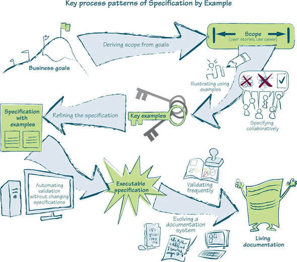
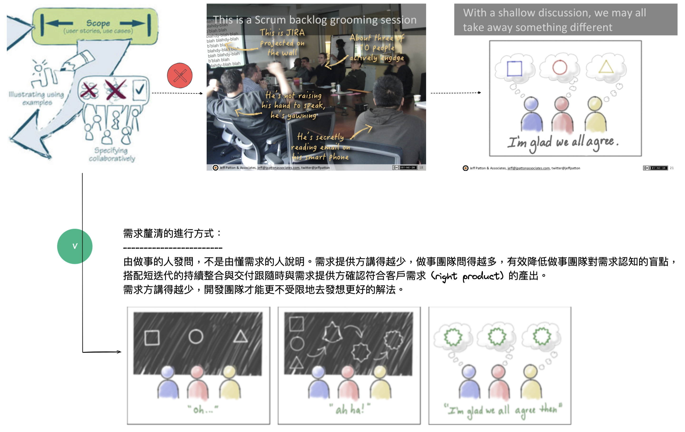

title:: 實例化需求 (Specification by Example)/Key Process Patterns

- 
- ## Deriving scope from goals
  團隊以客戶的業務目標開始，經由協作了解背後的價值並界定預計達成的目標範圍，產生使用者故事 (user stories) 並且能簡單舉例 (high level examples) 說明之。
- ## Specifying Collaboratively
  SbE 的重點之一，經由團隊的共同討論 (face-to-face with whiteboard) 並探索出最佳解法 (solutions)。
  
  Figure. Illustrating specifying collaboratively, by Gojko and Jeff Patton & Associates
- ## Determine Key Examples
  團隊成員通過工作坊的方式制定需求規格，通常來說，先用實例來描述，推測一些規律，轉成用表格表達，可能發現更準確的規律。
  Every acceptance criterion generates new examples; every example generates new scenarios. Teams should refine their specifications to merge similar examples, reject the ones that introduce noise, and choose the most meaningful or descriptive ones.
	- Reference: [Writing Great Specifications](https://livebook.manning.com/book/writing-great-specifications/chapter-1/point-15744-257-257-0) and 50 tips of ....
	- #+BEGIN_TIP
	  Complex specifications
	  * ==Don’t invite discussions==
	  * Technical model is misaligned with the business model
	  * Described at the wrong level of abstraction
	  * ==Usually means refining a story isn't done==
	  #+END_TIP
	- #+BEGIN_TIP
	  Key examples
	  *  A small number of relatively simple scenario
	  * ==Easy to evaluate and argue about boundary conditions==
	  * Easier to discover and resolve inconsistencies
	  * (raw examples won't provide above two advantages)
	  * Right level of abstraction to describe situation better
	  * Satisfy business needs faster
	  * Modularized software reduces future maintenance costs
	  #+END_TIP
- ## Refining the specification
  需求規格應該是精確、能被驗證、不言自明並且是跟商業規則有關係的。承上信用卡清算案例，一個明確的需求
	- #+BEGIN_TIP
	   Good specifications
	  * Have a concise description
	  * Have a clear model
	  * Use business language
	  * Show a clear connection between inputs and outputs
	  * ==Describe (focus on) WHAT not HOW==
	  * ==Avoid GUI specifics==
	  #+END_TIP
	   
	  思考點：當預付點數只剩 6.5 但票價要 7 元時，你買還是不賣這票呢？
- ## Automating validation without changing specifications
- ## Validating frequently
- ## Evolving a documentation system
-