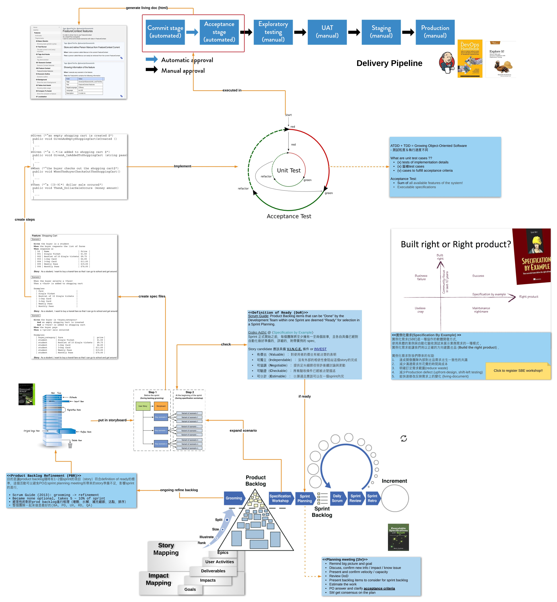
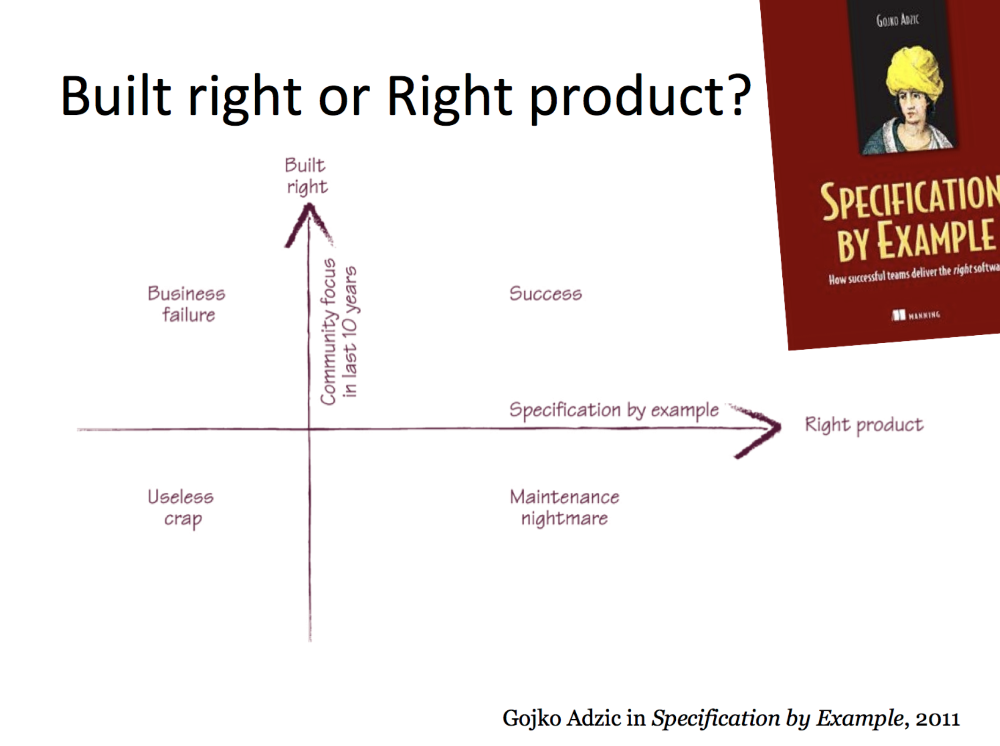
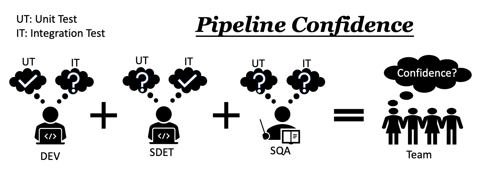

public:: true

- ## Process Overview:
  
- ## 實例化需求 (Specification By Example)
  id:: 62b99b45-8f82-4f1c-ab2f-807e4ba85e22
  實例化需求 (SBE) 是一種==協作的軟體開發方式==，使用==具體的案例與自動化驗收測試來展示業務需求==的一種模式，實例化需求能讓我們用以==正確的方向建置產品 (Build the right product)==。而釐清需求的 Product backlog refinement meeting (PBR) 正好位在開發流程==中央的位置==，上承 product backlogs (planning) 下接 implementation and verification (development)。團隊能如實討論及產出 PBR 的交付項目，a.k.a "Acceptance Criteria"，才能有效確認開發上下游對產品需求的一致性! 另外，實例化且有一致共識的需求規格，對於後續==手動測試、測試自動化及 pipeline 的效率與信心都有莫大的影響==，將於後續說明。
  
- ## 實例化需求對我們帶來的幫助
	- ### SbE 為團隊帶來的好處：
	  * 對產品需求產生一致性的共識 (same goals)
	  * 減少溝通需求所花費的時間與成本 (communicate efficiently)
	  * 明確訂定需求範圍 (reduce waste)
	  * 減少事後重工與線上非預期狀況 (upfront-design, shift-left testing)
	  * 能快速修改反映需求上的變化 (living-document)
	- ### SbE 十年後的驗證
	  [Specification by Example, 10 years later](https://gojko.net/2020/03/17/sbe-10-years.html)，內有說明 ==SbE 書籍相關論述==十年後社群調查的結果！
	- ### 對 CI Pipeline 的信心
	  id:: 62ba9533-3e8b-4ed1-a3cd-1f8143878aae
	  #+BEGIN_QUOTE
	  What we see sometimes is, folks are very focused on automation and speeding things up, but not like, am I actually getting what I want from it? So for example, again, back to the automated testing example, often regression tests, there’s a lot of focus on ==automating everything==, but sometimes the output, the test results, are ==too difficult for a team to actually understand== that they disregard the test.                 ~ Tim Cochran, Technical director at ThoughtWorks
	  #+END_QUOTE
	  一樣的，今天 pipeline 檢查了很多東西，但大家還是沒有信心，為何呢？ 因為沒有一個人真正了解整個測試的內容！RD 的 unit test，QA 的 integration test，都是沒有充分溝通的狀況下，各別自由發揮，以至於到後來彼此都不知道對方的做了些什麼，有什麼沒做，就連 Service QA 或 PM 也都無法掌握。==而 SbE 讓全部的人對產品需求有一致共識與針對 key examples 所撰寫的自動化測試，才是讓大家對 pipeline 檢查內容有全面了解的作法！==
	  
- ## 執行細節
  For full content, see "Hierarchy" section below
- ## Takeaway
  * Focus on collaboration and communication
  * Don’t jump to implementation details
  * Seek for missing business concepts
  * Group by commonality and focus only on variations
  * Try it out!
  * Try preserve business language
  * Plan up-front to automate
  * Treat automation code as first class citizen
  * Validate frequently and include in CI
  * Consider having an “sprint” test suite (valuable to show progress)
  * Living documentation
  * Keep specifications as simple and short as possible
  * Organize specifications (by functionality)
  * Evolve specifications
  * ==Make documentation accessible==
	- #+BEGIN_QUOTE
	  “Specification is not a programming technique, but a communication technique”
	                                                                   ~ Gojko Adzic — Bridging the Communication Gap
	  #+BEGIN_QUOTE
-