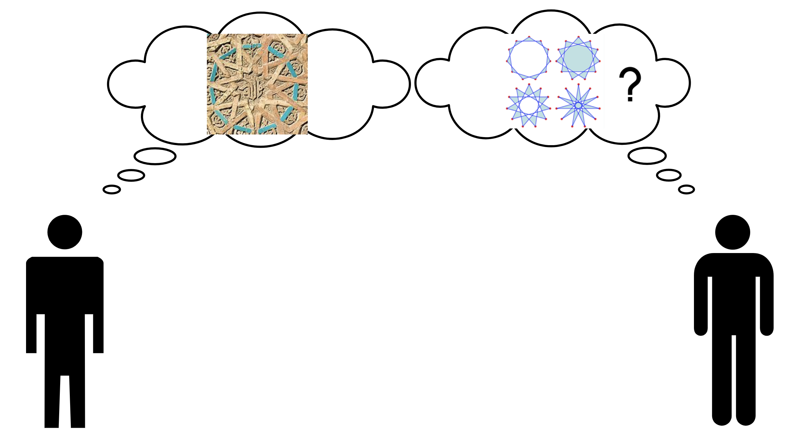
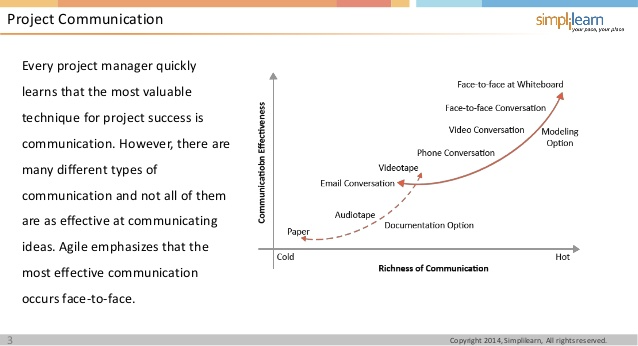
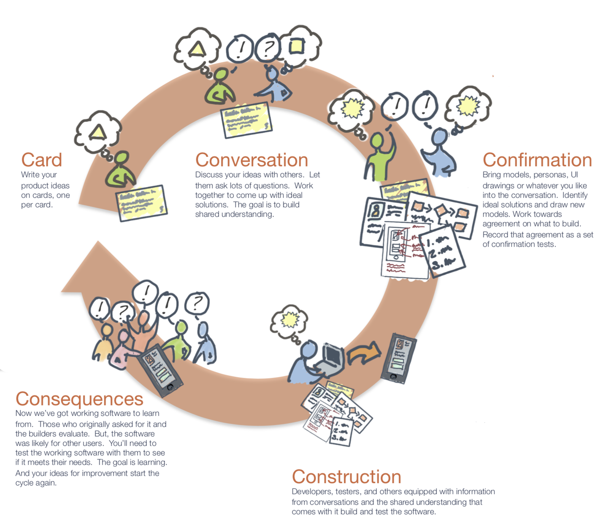
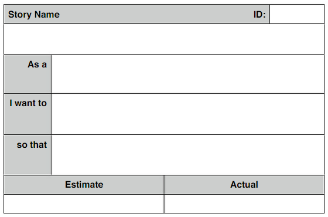
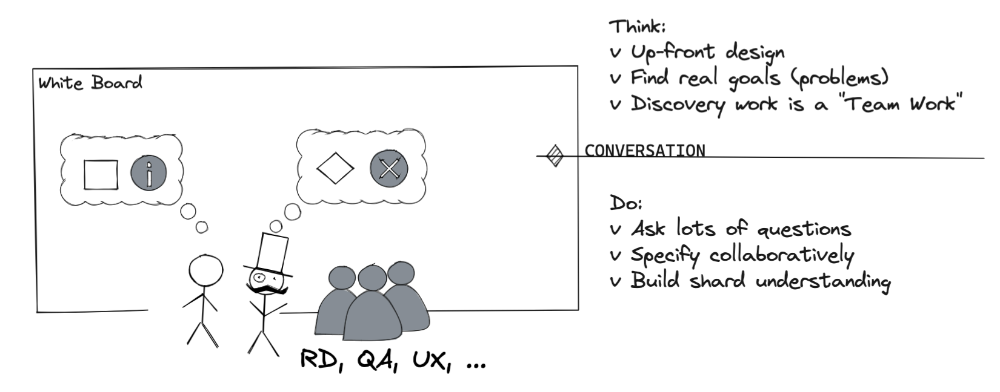
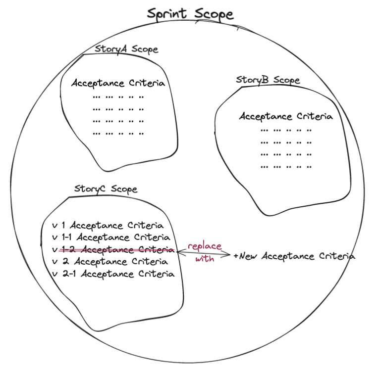
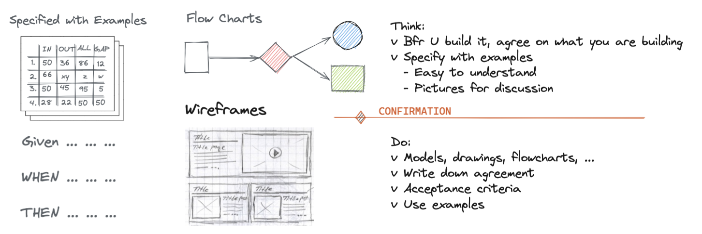
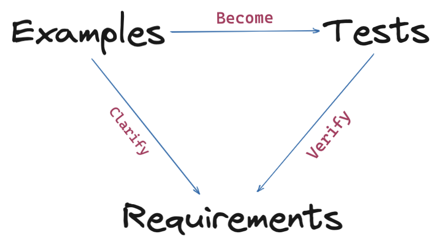
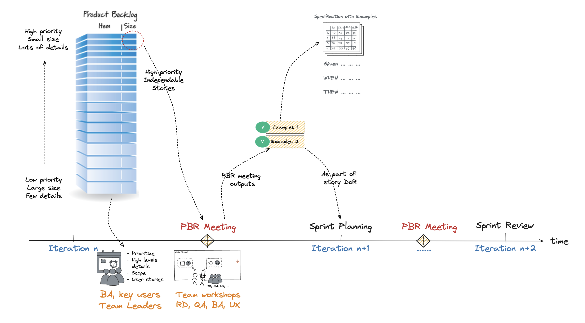

public:: true
type:: blogpost
title:: 實例化需求 (Specification by Examples)/workshop

- {{embed ((62b99b45-8f82-4f1c-ab2f-807e4ba85e22))}}
- ## Specification Game and Communication Steps
	- 今天有一位地主要求建築師說：我想要以一個有十一個頂點的星形多邊形雕刻來裝飾我的外牆！但建築師在嘗試畫出十一星形圖時就發現，光十一頂點星形就有好幾種畫法，遑論還有邊長、角度、大小、顏色等等變異，那麼建築師要如何能確認需求呢？
	  
	  [Figure reference: https://en.wikipedia.org/wiki/Hendecagram](https://en.wikipedia.org/wiki/Hendecagram)
	- 所以光一個簡單的圖形，光是用白底黑字的文字來描述需求就感受到其中的限制了，更不用說要用文字來溝通==複雜的商業邏輯==是件多沒有效率的事了...... 參照：[[溝通無效率]]
	- ### Communication Effort
		- 既然需求是談出來的，那首要解決溝通的成本問題了！從下圖中，兩個或多人之間能直接同步溝通並同時使用聽覺、視覺和語言 (例如輔助以白板這類的工具)，能讓信息流以最有效率的方式傳遞。
		- 
		- Reference: Simplilearn (from Ambler, 2002; after Cockburn, 2006)
	- ### Communication Steps
		- 既然溝通的方式確立了，接下來就來說說溝通的步驟與重點提要。在 Jeff Patton《User Story Mapping》中有個所謂的＂5C＂循環的概念，正是闡明了溝通的五步驟。
		- 
		- #### 步驟一：Card
			- 需求在進入更詳細的討論時，會被拆解成數個小的使用者故事，而討論時會以故事卡片的方式交付給團隊做討論，卡片上會有標題與 Who (As a)、What (I want) and Why (so that) 三要素。
			- 
			- #+BEGIN_TIP
			  * One card one idea
			  * Don't write too much, only the content fits in a card
			  #+END_TIP
		- #### 步驟二：Conversation
			-  
			  Conversation，沒錯這可是 5C 中最重要的步驟了，溝通與對話的目的是為了建立基本共識，這共識包含了確認目標 (Problem) 與範圍 (Scope)。
			- ##### 目標
				- 客戶都提需求來了，怎麼還要確認目標，這又怎麼說呢？
				  參照故事： [[Story of F-16]]
				  從 F-16 誕生的故事，我們了解到需求的確立是團隊一起參與，通過不斷地提問問題來釐清背後真正想要解決的問題並產生共識。如果當初通用動力公司==沒有去了解需求後面要被解決的問題==而只是依客戶照需求去研發新一代的高速飛機引擎，或許今天就不會有這架最成功的戰機問世
				- #+BEGIN_NOTE
				  * 需求不會是一個明確的解法!
				  * 需求是模糊的，客戶很難去抽象出他的問題
				  * 不要想一次把 Spec 定義清楚
				  #+END_NOTE
			- ##### 範圍
				- 通過討論，==我們期望能找出 80% ~ 90% 的使用者情境 (並非完善所有需求)，而討論是非常花時間的，估計討論時間會占用約 5% ~ 10% 的開發時間==。盡量避免讓 PO 自己一個人花很多時間去完善需求，而應該在精煉會議上讓大家透過白板討論與互動，才是讓團隊能==真正==、==有效率地==理解需求背後的目標！
				- 避免加班的最好辦法，就是在開始實作前就明定這次 sprint 的範圍。實作開始後，對於意外發現的重要需求，應該置換其它重要性低的需求或是延長交付時間，而非一昧的加班或壓縮測試的時間 (降低品質)。參照： [[Triple Constraint - why scope important for Agile]]
				- 
			- card-last-score:: 5
			  card-repeats:: 1
			  card-next-schedule:: 2022-05-12T08:48:32.167Z
			  card-last-interval:: 4
			  card-ease-factor:: 2.6
			  card-last-reviewed:: 2022-05-08T08:48:32.173Z
			  #+BEGIN_TIP
			  討論需求的目標在確立基本共識
			  * 目標與問題是不可變的
			  * 解決方案 (AC) 是可變的
			  * 用 CARD 溝通 (Face-2-Face + 白板)
			  #+END_TIP
		- #### 步驟三：Confirmation
			- 
			- #+BEGIN_TIP
			  * 知識的詛咒：專家很難用白癡的話敘述一件事，所以呢？就叫白癡用問的！
			  * 故意用錯誤的描述來引發討論 (何時做：當需求模糊不清。如何做：用具體的==錯誤==例子)
			  * 學會問＂可不可以不要＂
			  #+END_TIP
		- #### 步驟四：Construction
			- 好的範例有助於了解商業需求 (business rules) 
			  
		- #### 步驟五：Consequence
			- 在每次的迭代後要去驗收結果。
		- 思考點：
			- 大家你覺溝通的五個步驟中，哪個步驟的成本 (Cost) 最高？
			- 大家你覺溝通的五個步驟中，哪個步驟的影響 (Impact) 最大？
	-
- ## Refinement Meeting Explains
	- <ins>什麼是產品代辦清單精煉</ins>
		- 經由一項持續進行的活動對於代辦事項不斷的做梳理、拆解與排序，使其更小且定義更精確，可參考 Scrum guide 的描述：
		- #+BEGIN_QUOTE
		  Product Backlog refinement (PBR) is the act of breaking down and further defining Product Backlog items into smaller more precise items. This is an ==ongoing activity== to add details, such as a description, order, and size. Attributes often vary with the domain of work. [Scrum guide](https://scrumguides.org/scrum-guide.html#product-backlog)
		  #+END_QUOTE
		- 會議目的：目的是讓 product backlog 隨時有足夠 1 至 2 個 sprint 的項目 (story) 符合 definition of ready (DoR) 的標準。這個活動可以避免 PO 在 sprint planning 會議時所帶來的 story 準備不足，當下團隊才忙著釐清許多問題，甚至有些外部相依性的問題無法在當場釐清，影響 sprint 的進行。
		- 其它解釋可參照 [[精煉會議解釋]]
	- <ins>精煉會議前置準備</ins>
		- 通常一個使用者故事能放進精煉會議做 AC 的討論，一般是經過以下三步驟：
		  * Phase 0 - Preparation of user stories (PO to prioritize, remove dependencies)：通常由 tech lead 與 PO 做先行的討論與排序出重要性並找出無其它依賴能做更細節展開討論的項目。
		  * Phase 1 - Estimate and split stories, consume / maintain product backlog：會議中 PO 說明故事卡內容並交由大家根據複雜度去估點或分拆為更小的使用者故事，重複步驟直到使用者故事複雜度小於 8 或 13 點 (根據團隊習慣)。
		  * Phase 2 - Key examples / acceptance criteria (for story point under 8/13)：對於夠小的故事根據重要性於會議中開始討論並產出此故事的驗收條件 (Acceptance Criteria)。
	- <ins>會議週期與時間安排</ins>
		- 
		- 若以兩週為一個 sprint 的週期來說，PBR 會議通常會安排在一、二週中間找個半天至一天的時間。
	- #+BEGIN_TIP
	  __Recommend__:
	  	* Preserve ==5 ~ 10%== of your sprint work hour to do refinement meeting
	  	* A full day or 2 separated meetings
	  #+END_TIP
	- <ins>會議內實行方法</ins>
	  So, as a planner, just prepare your story card and maybe some wireframe which can inspire the imagination, so that team can discuss the scenarios with real data.
	  * Divide team into several groups
	  如果人數足夠，可以把團隊分為幾組，每一組內盡量包含功能團隊的各種角色。
	  * 7 mins for each round
	  以 7 分鐘為一個輪 (timebox)，分組下去討論。
	  * Explain AC to whole team
	  一輪之後，各團隊輪流解釋成果給其它人聽，其它的隊伍可以提出問題質問。每團隊都講過後，各自再下去修改自己團隊的提案。
	  * 2 ~ 3 rounds for each story
	  兩至三輪後，團隊內應該可以對這個使用者故事能有一個基本的共識了。最後就算自己不是負責這個使用者故事的代碼實現，但是也因為參與過討論，也會了解這個使用者故事的內容了！另外呢，有爭議 (dispute) 的地方也盡量在 workshop 內就討論解決完。
	- #+BEGIN_TIP
	  如果團隊沒有足夠時間這針對＂每個＂使用者故事分組下去討論，也應該==每一組分配一個故事==下去討論 AC，等所有故事都討論完後，每組上台介紹討論出來的 AC 給所有其它的團隊成員聽。
	  #+END_TIP
	- Example 寫甚麼？
	  * Specific examples for AC, golden use cases, business logics.
	  * 要求團隊以外的人來讀讀寫出來的 AC，看看也是否可以理解這個 story 想要達成的目標
		- Also explain relation with:
			- DOR → planning meeting
			- DOD → task closed
	- 思考點：
		- [Why PO needs to say ‘No’ (1 mins) ](https://youtu.be/DoFj3Y_St74?t=200)
- ## AC Practices in Workshop
  請有經驗有在實作 SbE 的團隊，準備一份合適 workshop 練習的 user story card，並分組下去依照上述實行方法開始練習。
- ## Summary
  我們從溝通