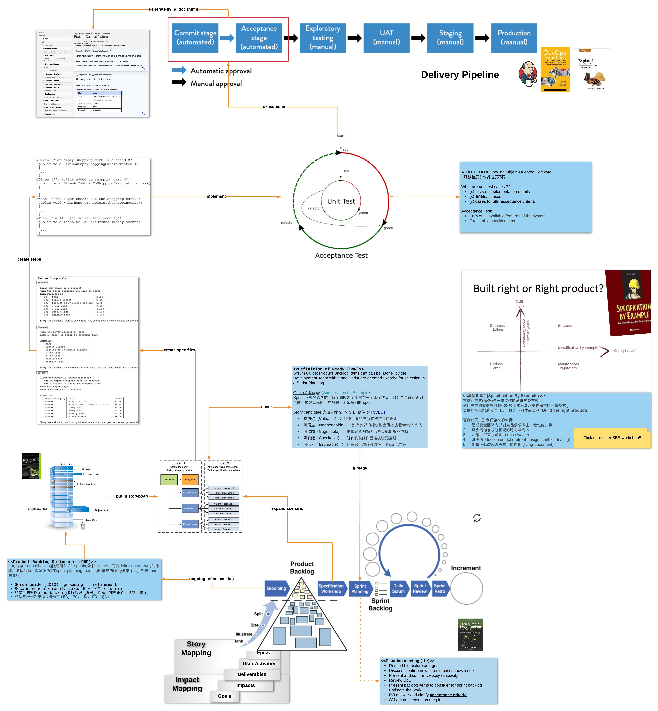

- ## Process Overview:
  
- ## 實例化需求(Specification By Example)
	- 實例化需求(SBE)是一種協作的軟體開發方式，使用具體的案例與自動化驗收測試來展示業務需求的一種模式，實例化需求能讓我們用以正確的方向建置產品 (Build the right product)。
	  
	  實例化需求對我們帶來的幫助
	- 達成開發團隊內部對產品需求產生一致性的共識
	- 減少溝通需求所花費的時間與成本
	- 明確訂定需求範圍(reduce waste)
	- 減少Production defect (upfront-design, shift-left testing)
	- 能快速修改反映需求上的變化 (living-document)
	- Product backlog refinement meeting and workshop (PBR) 正好位在開發流程==中央的位置==，上承 product backlogs (planning) 下接 implementation and verification (development).
	  如實討論及產出 PBR 的 deliveries，a.k.a "Acceptance Criteria"，才能有效確認開發上下游對產品需求的一致性!
	- [Specification by Example, 10 years later](https://gojko.net/2020/03/17/sbe-10-years.html)，內有證明 ==SbE 書籍相關論述==，十年後社群調查的結果！
- For full content, see "Hierarchy" block below