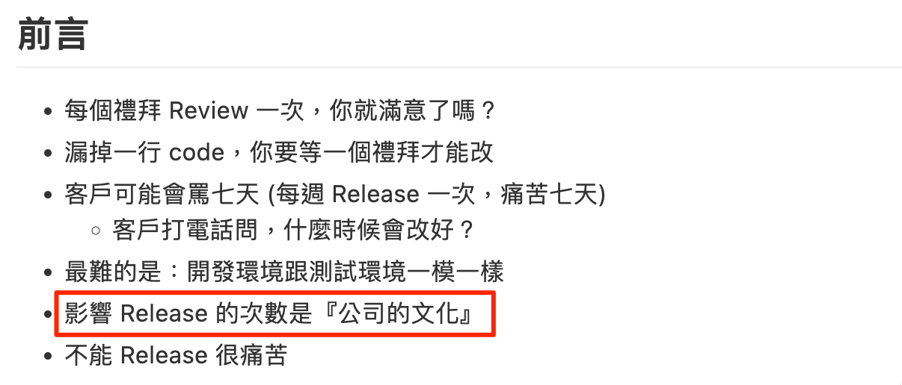

- Subtitle: 是在快三小？到底是別人有問題還是有什麼是我們不知道的？
- ## The Dashboard
	- Dashboard 只反應目前的狀況，如果不做任何的改變，上面的數字其實也不會變動，所以如何來改善上面的數字才是後面的重點！
	- 影響交付頻率是公司文化  (culture) 而非技術 (technology)！
	  
	  Figure. [Rudy Lee 李智樺](https://ruddyblog.wordpress.com/)，《人工智能驅動下的開發者體驗》 - DevOpsDaysTPE 2023
- ## Digital Transformation
	- {{embed ((65103e74-3540-4ece-a12d-6660a99bc609))}}
	- {{embed ((64381dc2-c828-4d59-b9e8-271af3fbce27))}}
	- ### The Facts
	  |公司|部署頻率|Note|
	  |--|--|--|
	  |Amazon|136,000 次/天|per minutes|
	  |Google|5,500 次/天|per minutes|
	  |Netflix|500 次/天|per minutes|
	  |Facebook|2 次/天|Data from 2012. ==On-demand since 2017==|
	- 工程師人數多本來每日交付次數就應該更多，原本想法是計算出「每位」工程師的每日平均交付到生產線的次數比較才有比較意義，但其實公司具備快速交付 (on-demand) 的「能力」才是重點，至於最後要多快是可以根據商業需求來調整！
	- Reference:
	  * [Facebook - Rapid release at massive scale](https://engineering.fb.com/2017/08/31/web/rapid-release-at-massive-scale/)
	    > We make mobile release candidates available every day for canary users, including 1 million or so [Android beta testers](https://play.google.com/apps/testing/com.facebook.katana).
- ## Agile Methodologies
	- 敏捷開發： 小增量、多迭代與尋求回饋
	  
		- Source: Rally ®, Broadcom software.
	- Emerging flavors of agile—including test-driven development, behavior-driven development and set-based engineering address the specialized needs of the broad range of users now employing agile approaches.
	- #+BEGIN_QUOTE
	  “Delivering high-quality end products quickly requires new ways of working, including agile development, rapid release cycles, automated testing and deployment and a ‘test and learn’ approach to changes.”  ~ McKinsey
	  #+END_QUOTE