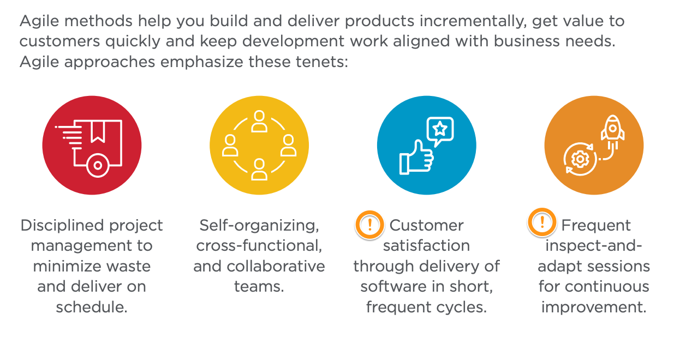

- Subtitle: 是在快三小？到底是別人有問題還是我們誤解了什麼？
- ## The Facts
	- |公司|部署頻率|Note|
	  |--|--|--|
	  |Amazon|136,000 次/天|per minutes|
	  |Google|5,500 次/天|per minutes|
	  |Netflix|500 次/天|per minutes|
	  |Facebook|2 次/天|Data from 2012. On-demand since 2017|
	- 原本想法是計算出「每位」工程師的平均交付到生產線的次數才比較有意義，但最後覺得是該公司已經有「能力」做到分鐘級別的交付流水線才是重點！
	-
- # Culture Matters
- # Methodology
	- ## Agile Methodologies
		- 
			- Source: Rally ®, Broadcom software.
		- Emerging flavors of agile—including test-driven development, behavior-driven development and set-based engineering address the specialized needs of the broad range of users now employing agile approaches.
		- #+BEGIN_QUOTE
		  “Delivering high-quality end products quickly requires new ways of working, including agile development, rapid release cycles, automated testing and deployment and a ‘test and learn’ approach to changes.”  ~ McKinsey
		  #+END_QUOTE
- # Reference