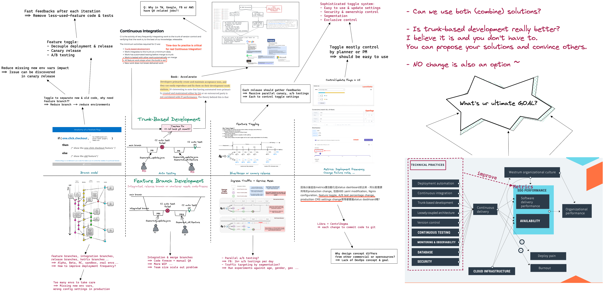

- 
- ## 團隊對於開發方式的抉擇
	- 對於 DevOps 所以提倡的主幹開發跟大部份人所熟悉的 feature branches 開發模式，兩者大相徑庭，在同個團隊中也無法混合使用。對於有興趣採用 DevOps 效率文化的團隊，是否應該設立流程方法與目標，進而一步步實踐呢？以下就常見的幾個場景，對於不同選擇所想解決的問題及面臨到的困難，簡單敘述一下，希望能幫助大家思考。
- ### Branch Model
	- 分支模式為兩種方法的主要差異所在，而這差異將左右後續整個開發流程的不同與效率。
	- 功能分支 (feature branch)：主要以不同的 git branch 來區分新與舊之間的代碼。
	- 單主幹開發 (trunk-based development)：主要以 if ... else 的邏輯單元搭配功能開關 (feature toggle) 來讓程式行為發生改變。
	- 使用功能分支的好處：大家應該都很熟，請自由發揮~~
	- 使用單主幹開發的好處：減少功能分支，就減少需要 merge 與整合環境 (ex: alpha, beta environments)，減少測試環境就能加速交付速度與減少環境變數與設定 (config) 的遺忘與錯置。加上 feature toggle 讓 decouple deployment & release 及 canary release 與 A/B testing 方便實作，大幅增加彈性與降低上版風險，然後真正實踐 DevOps 三步工法中的流動、回饋及持續學習與實驗。
- ### Test Automation
	- 在 feature branch 的開發模式下，蠻多團隊是 RD 寫單元測試而 AE 則負責自動化整合測試。當然兩者的代碼會在 "integrated branch" 上先做整合，完成整合測試後才會提交到主幹上面。所以一般 "integrated  branch" 在開發初期 pipeline 一般都會是紅色的 (pipeline CI failed)，一直要到給 QA 做測試的前幾天才比較有機會轉成綠色。但這樣的 RD 與 AE 的分工模式在單主幹開發 (Trunk-based development, TBD) 上卻難以施行！
	- TBD 被視為實踐真正的持續整合 (Continuous Integration) 所必需採用的方法，因為大家都在主幹上開發且每天至少要與主幹整合一次，所以當 pipeline 結果為失敗時，所有的功能開發就必需暫停下來，所以才會有所謂的 time-box fixing 的規則，亦即所有 pipeline 的失敗必需要在一個固定時間內修復 (ex: 15 mins)，否則造成失敗的 commit 就必須被回滾 (rollback)。所以在這樣的規則下，RD 提交程式代碼到主幹造成自動化整合測試失敗的結果是無法被接受的，==也沒有足夠時間等到 AE 提交相對應整合測試代碼的修改==。
- ### Release Strategies
- ### Performance Metrics
- ## 結論
	- 過去幾年來，我們所推動的各項要求與改變，其實都是在為了同個目標所努力，並非主管或團隊領導的個人選擇與偏好。個人建議團隊還是應該對於開發流程與目標進行深入的學習與討論，以便取得共識。最不希望見到的結果就是，大家沒有共識，所以在進行技術棧的選擇與採用時沒有一個標準與目標，只要方便、容易實踐就選擇它 ......
	  最後只要沒有目標，幾年後，你會發現，大家還是在原地打轉！！